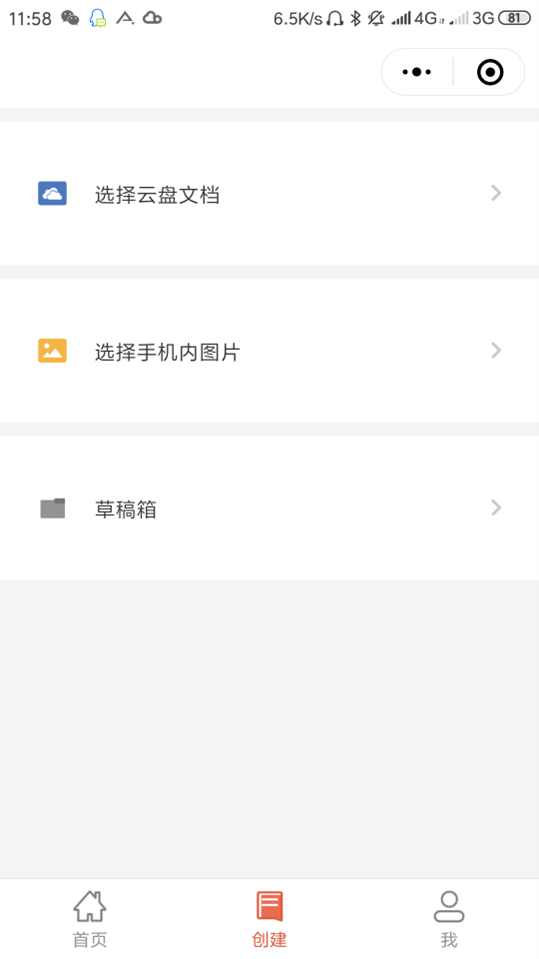
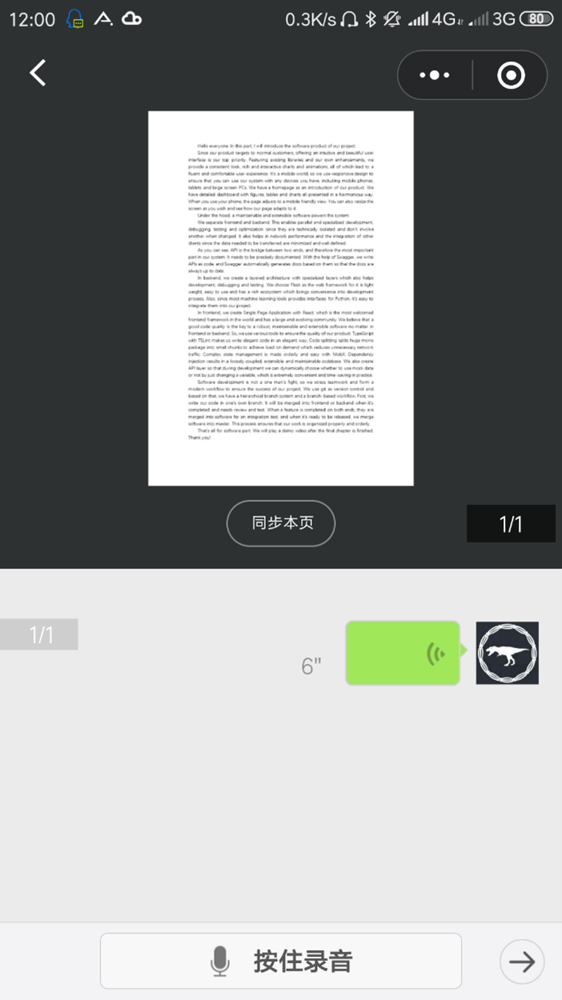
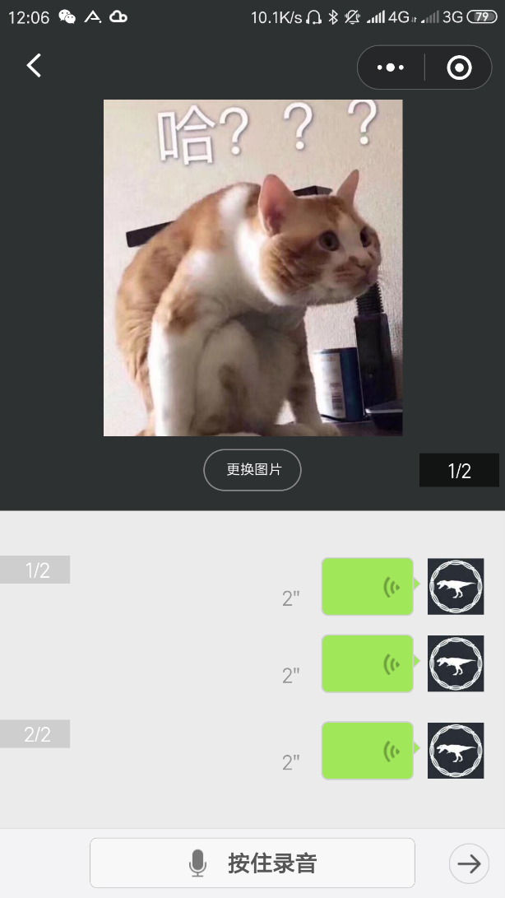
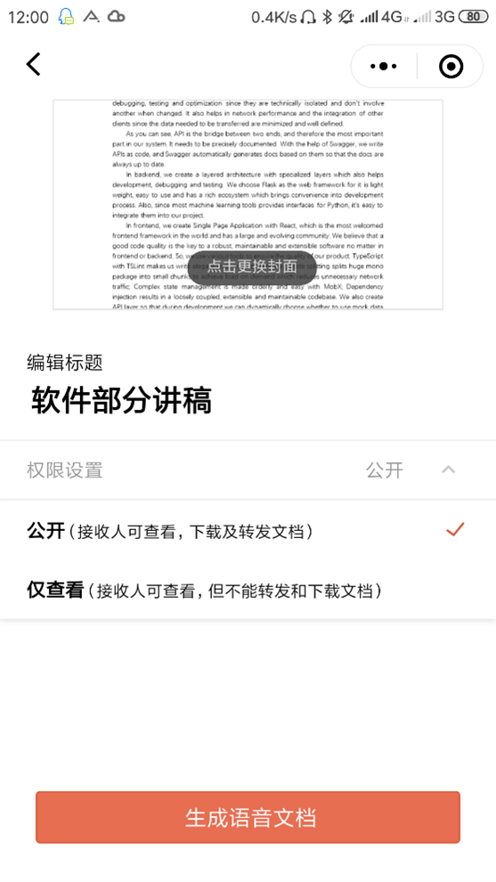
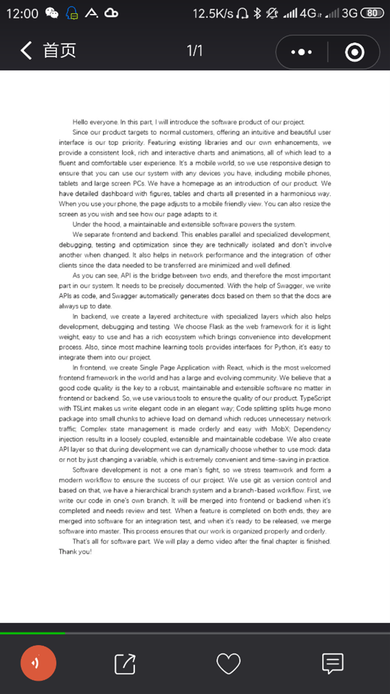
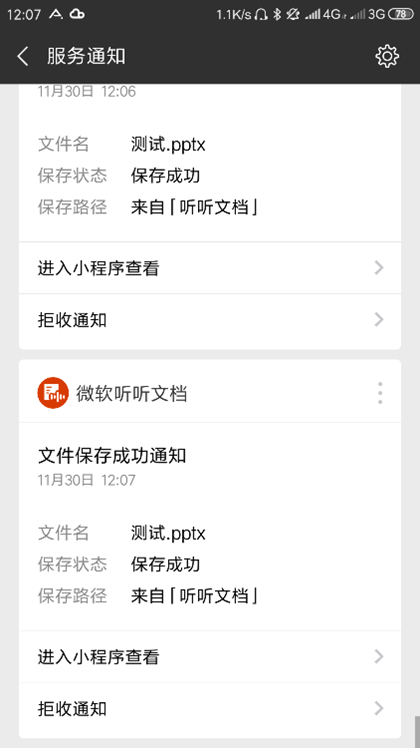
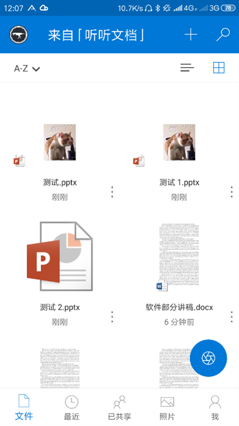

---

id_name: "ms-listen-to-docs-report"
date: "2018/11/30 15:39"
title: "微软听听文档体验报告"
tags:
  - 微软
  - 体验报告
lang: cn

---

# 简介

微软听听文档是微软新出的一个制作带语音的文档或者幻灯片的工具，它可以将输入的视频或者文档与语音合在一起，让用户能够边听边看一个文档，效率倍增。目前来说，工具用法非常简单，读取和制作都非常简单易上手，也基本能够满足基础的需求，但是仍然在用户体验方面有一些微小的瑕疵；同时，若能增加更多的信息来源，支持除了微信小程序以外更多的平台，以及增加一些更多实用性功能，相信这个工具能更好地发挥它的作用。

想知道更多关于微软听听文档的信息，可通过这个[微信推送](http://mp.weixin.qq.com/s?__biz=MzA4NzIyMDY0OA==&mid=2655392978&idx=1&sn=530985a36b1330a9c5495b60da487062&chksm=8b8e7c15bcf9f503aa17241ef15d8009d8e38de4debd332965062f8c8f88a8e410a9d5dd77b0&mpshare=1&scene=23&srcid=1130Ov95JqSqs9Wj9GjBG56f#rd
)查看。

# 用户体验

微软听听文档用户体验对我来说还是比较简单的。总体来说，首先选择需要制作的文档或者照片，然后对docx文档的每一页或者每一张照片说话，然后最后就可以分享了。可以分享到好友、朋友圈或者保存到OneDrive。

选择源文件

输入音频

对多个图片文件输入音频

预览

保存

可以直接从OneDrive上选择文档对我这种OneDrive深度用户来说非常方便。非常简单易用直观的界面可以让所有人无需教程就能直接上手做出听听文档。这个应用的用法甚至比一些电子相框的App更简单。看别人的听听文档的操作也很简单，就像在听有声书一样，手动可以翻页、也可以点击左下角控制声音的播放。

总的来说，应用的使用非常简单直观，对制作者和播放者也都很友好。希望这个工具能保持这样简洁而足够使用的功能，不要增加太多华而不实的功能增加操作的复杂度。

# 使用场景

我一开始这种需求的适用面可能不是很广，但是后来一想，认为在以下的情况下听听文档的形式可以发挥一些作用。

1.	给其他人展示一些PPT、图片或者文档

以往，要给其他人详细地展示PPT、图片或者文档，需要我们写一份文稿发给对方，以让对方对我们的工作有个详细的了解。但是这些文档的编写需要花很多的时间，而且写出来的文档本身是一次性的，并没有（也没有必要）被充分利用。如果使用听听文档，我们就可以直接通过说话这种方式快速地对方介绍我们的工作。当然，这种形式并不能替代正式且详细的文档方法，但是非常适合很多对正式程度要求不高，但是对速度、时间和效率要求高的情况，而这种情况在生活中是非常常见的。

2.	快速分享对一个事物的看法

这个使用场景有点像**转发并评论**，但是能通过让读者**边看信息边听发送者的看法，让读者更能身临其境，更能跟着读者的思路**，而且通过声音来表达观点也比文字能**表达更多的信息**（例如情绪、语气等），并且这种方式对分享者来说也比打字更有效率。

总的来说，这个工具的**高制作效率**、**图文声并茂**的特点让它非常适合**快速分享**。

# 改进功能

目前来说这个工具的功能虽然比较完善，但是如果能加入更多的功能，可以让这个小工具的适用面变得更广。

1.	增加更多的信息来源

现在似乎只支持docs文档和图片，我认为还可以加入更多的导入来源以增加适用面，例如**网址**（应用访问这个网址获得网址上的信息，并将网站上的内容作为文档内容）、**视频**（像短视频一样）等。

2.	支持显示字幕

现在软件只能播放播放者录制的音频，如果能够利用微软的语音转文字技术将播放者说的话转成字幕甚至提供下载的话，可以让听众有更好的体验。

3.	听语音的时候支持拖动播放进度条

同样，现在工具只能将语音从开始听到结束，不支持修改播放的时间，给用户带来了一些不方便。当然这个可能是因为微信本身就不支持的锅，但是如果能够支持就非常好了。

4.	制作文档的时候支持动态修改文字大小

文档编写的时候的字体大小一般很小，并不适合直接通过手机屏幕查看内容。若直接用原来的字体大小来显示，那么效果就像下图一样，根本看不清晰。希望能在编辑的时候编辑字体或者缩放大小，以让用户查看的时候体验最优化。

5.	保存到OneDrive的时候把录制的语音也保存

现在在分享的时候可以选择保存到的文档，但是据我自己的测试，似乎不会将语音保存下来（文档就会直接保存一个副本，而图片会被保存为一个PPT）。如果能保存下音频，可能会让分享更容易。

6.	支持更多平台，尤其是PC端

现在只有微信小程序，只能通过手机在微信上操作，但是微信小程序的限制过多，微信本身的生产力也非常差，很多功能都不支持，加上手机本身的限制，要制作一个稍微复杂的文档，**工作效率会非常低**。希望以后此工具能支持更多的平台，例如**Web端**（这样就可以在电脑上通过键鼠高效地制作和查看听听文档，不需要都使用不方便的手机来操作）、**Android和iOS的Native客户端**等。

7.	保存到云盘时的一些用户体验细节

现在在分享界面，用户选择保存云盘，系统会首先显示一个“正在保存”的提示，几秒后提示消失，在真正保存成功的时候会发出一个微信通知。这就给用户造成了一些误解：系统显示正在保存，然后直接退出，用户此时会以为**保存出错**，于是可能会**重新点击保存**。之后用户才发现有个通知通知保存成功，这样用户可能会重复保存多个副本。如下图。

保存中

保存成功通知

重复保存了多个文件

一些可能可用的改进的方法：

1.	点击保存到云盘时，直接提示用户正在保存，请关注提示
2.	正在保存的提示直到真正保存成功的时候才关闭，并给予用户操作的真正结果的提示
