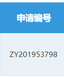
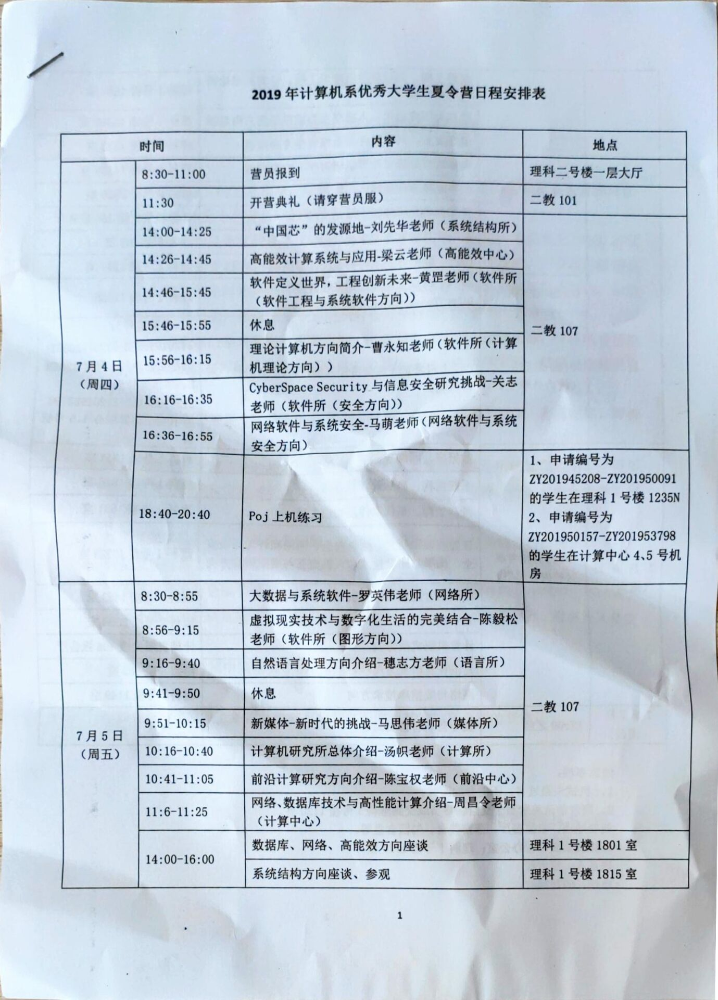
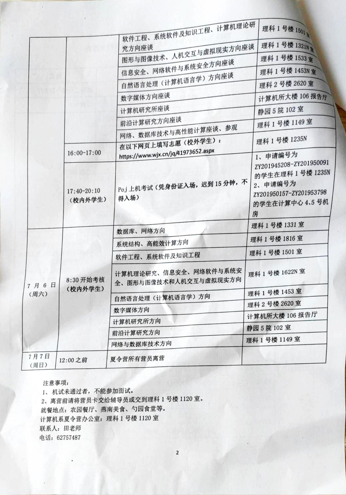
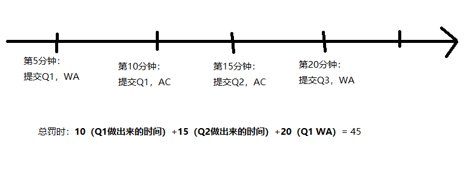
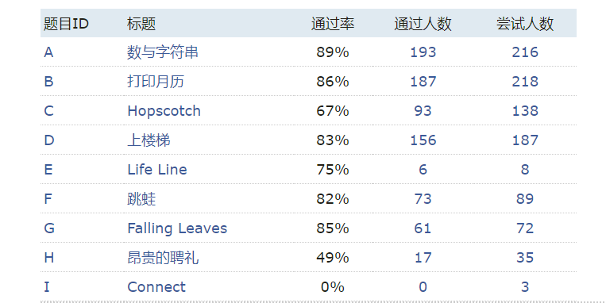
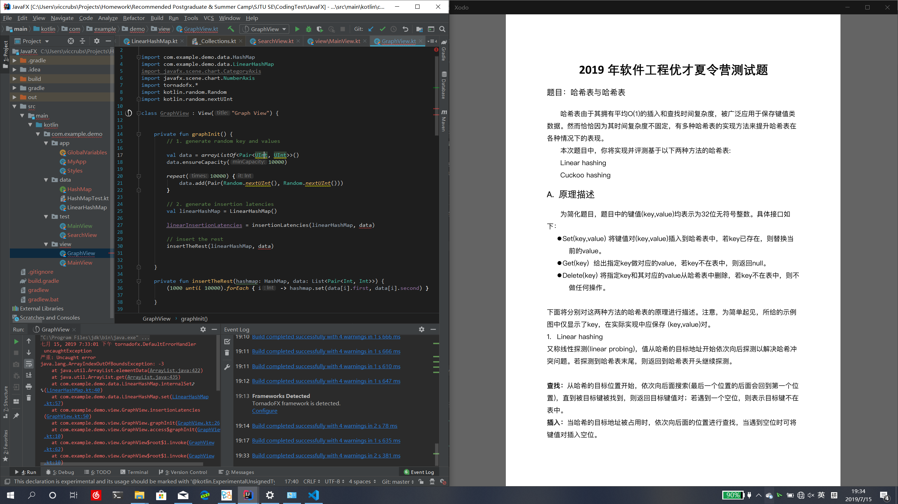
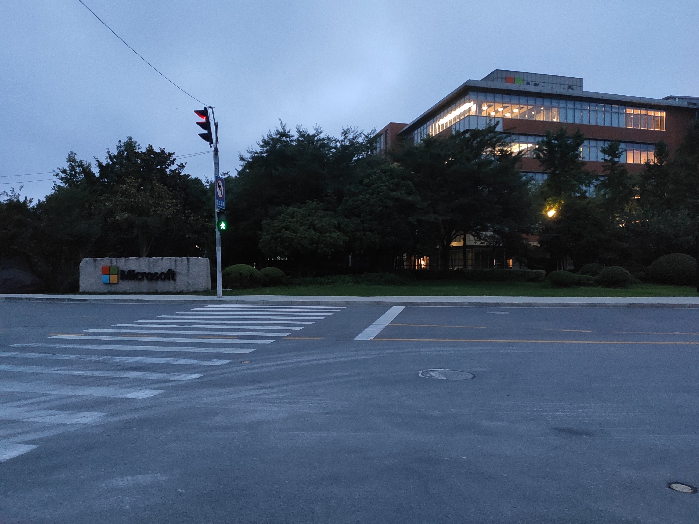
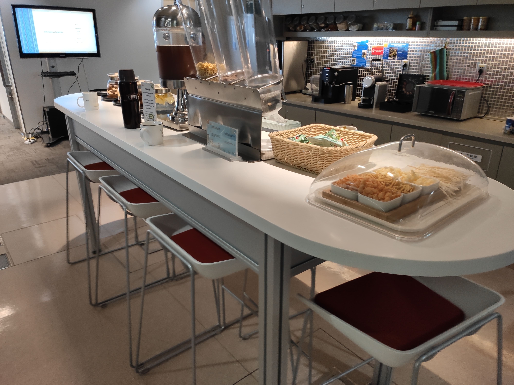

# 怎么又要保研了？

其实我从大二开始就开始准备**直接去工作**的。根据我的规划，**项目**、**比赛**、**刷题**、**实习**和**转正**，之后就是直接踏入职场了。而这个规划以外的、很多同学大学期间做的工作，例如说找老师、进实验室、做科研、发论文，我完全没有想过。

到2019年4月，这个规划进展非常顺利，项目、比赛都有能拿出来的成果，刷题也勉勉强强足够应付MS的要求，实习Offer也顺利到手。

结果没想到这个时候发生了一件影响颇深的事，那就是**贸易战**。由于个人无法接受996，所以外企几乎成为了唯一的选择。但是我认为根据这几年的国际局势以及国内996的趋势，外企在中国的发展前程是比较受限的。所以，趁着这么好的机会，读一个研究生，不仅在以后找/换工作为自己增加筹码，还可以避开这几年的“乱世”，多观察多体验，找到真正属于自己的道路。虽然很可能最后我可能还是会外企，待遇比本科出来只低不高，但还是决定现在去读研。由于最终目标还是工作，所以在找夏令营时有几个条件；

- 不直博，只读硕
- 毕业越快越好
- 最好允许实习

我的个人情况可以参考我的[简历](/resume)。在这个暑假中，我参加了**北大信科**、**上交软院**和**南大软院**的夏令营。

# 北大信科

| 事项       | 值                                                                        |
| ---------- | ------------------------------------------------------------------------- |
| 时间       | 见下表                                                                    |
| 机考和结果 | [百练OJ的比赛](http://bailian.openjudge.cn/xly2019/)，AC 3/8，排名 97/225 |
| 面试情况   | 计算中心，网络、数据库和高性能计算方向                                    |
| 结果       | 优秀营员                                                                  |

## 日程

| 时间                   | 活动           |
| ---------------------- | -------------- |
| 5月16日-29日           | 网上报名       |
| 7月4日上午             | 签到，领取营服 |
| 7月4日下午到7月5日下午 | 讲座           |
| 7月4日晚上             | 练习题         |
| 7月5日晚上             | 机考           |
| 7月6日开始至闭营       | 面试           |

## 报名

本院每年都有几位同学去清华，但是已经有几年去北大的一个人的都没有。研究了后发现，可能是因为我们是软件（而不是计科的）专业的，所以研究生也更倾向于去软件相关的学院和专业（而不是计科）。而北大的软院（即软微）的情况比较特殊，北大信科是传统意义上的计科，所以最后没人去北大了。

其实我也一直是这么想的（去软院），且由于北大信科要三年，而且（一般来说）学硕可能也不会太允许实习，所以我也一直没啥兴趣去。只不过到最后DDL想了想还是可以去北大了解了解，再加上4年前也去过一次北大的信科夏令营（给高中生的），所以感觉可以试试。最后成功收获几个极限操作：**网申在DDL前2小时完成**，**找老师要推荐信在和材料投递在DDL前4小时完成**，以及获得被入选夏令营的**最后一个报名号**。

另外，北大的报名不需要寄送材料，29日晚上前在网上填报，31日晚上上网上提交扫描版申请表、成绩单、自述和其他奖状什么的就可以了。

推荐信也把我搞了一波。首先，29日结束的网申不需要推荐信的任何材料，31日结束的材料提交中，需要确认有哪两位老师进行推荐，并且需要他们的联系方式等信息，不需要实际上拿到推荐信。至于推荐信本身，只需要等到夏令营报道的时候才需要提交。而我网申根本就没有找老师，而是等到30号才开始找老师，直到31日晚上才确定推荐的老师，之后6月底结果出了才去找老师要的……找老师的过程比较艰辛，问了6、7个本院的给本科生上过课的老师，最后在最后一天才确定下来……所以如果像我一样之前和老师除了上课再无交集的同学，可以早点去找老师，并且胆子要大一点，人在屋檐下不得不低头嘛。

最后今年本院只有我一个人去了，其中一大原因是7月4日本院有课考试，而夏令营报名期间考试安排还没有出，所以几位大佬也直接没有报名。而我经过胡乱分析.jpg，认为我4号有考试的几率比较低，搏一搏单车变摩托。最后几位大佬果然有考试，而我果然没有考试。另外，认为北大只招一个是不对的，因为在我夏令营的那几天中发现其他学校的好像都去了好几个，只有我校就去了2个人（加上一个电子方向的同学共3个，夏令营共400人，注意是南大总共就去了3个），另一个小伙伴还是去叉院夏令营的。所以如果学弟对北大感兴趣的话，可以勇敢一点报名，有考试也不用怕，鸽了不就完事了，夏令营鸽了一点影响都没有。

## 讲座

前两天都是白天讲座，白天讲座还是蛮重要的，因为信科还是个比较大的院系，下属了很多的实验室（见下面日程安排表）。每个老师在讲的时候会讲讲自己实验室的基本情况，比如研究方向、导师的情况、过往学生、招生计划等，对北本之外的同学来说是一个非常好的了解渠道。

我印象比较深刻的包括软件工程和系统软件方向的讲座。这个实验室（软工所，[官网](http://www.sei.pku.edu.cn/)）最大的特点是它有**3名院士19名博导**，而且保研只招直博生……从时间也可以看到这个实验室讲的时间是最长的（接近1个小时），因为他们老师多方向多，中间还穿插讲解了之前毕业的一些大佬学长学姐的情况、一些他们的项目情况等。他们的名额也非常多，今年似乎有19个直博生的名额。这个实验室的人员配置和做的方向真的是让我叹为观止，感觉真像是他们自己说的“一个实验室和其他学校一个系进行竞争”的情况。

另外，其实听讲座期间我还是比较失望的，因为我还是对学术真没什么兴趣，但是绝大部分实验室做的都是学术工作。并且，很多实验室的博士名额比硕士多（软工所的19比0是最极端的……从今年的优营名单也可以发现直博119多于硕士73），对只想上硕士的我来说有点不对口。

听到后面我甚至有点不想去了，但是最后一个计算中心的老师讲的激发了我的兴趣。计算中心（[官网](https://cc.pku.edu.cn)）严格来说不是信科下面的研究所，而是一个机构，管理整个北大的所有信息设备的机构。只不过它也培养计算机应用技术专业网络、数据库和高性能计算方向的研究生。听完讲座并了解一番后，我的感觉是：

1. 中心做的工作比较实
2. 中心只招硕士，招的人数比较少，每年保研3个人，考研1-3人，而硕导有7位，师生比比较高；
3. 中心几乎没有科研压力，并且只需要学位论文就可以毕业了，所以应该也不会“被压榨”（最多也就是学不到什么东西，但是反正也没怎么期望……）

所以即使发现中心的资料在网上几乎完全找不到，知乎、导师评价网等完全没有相关信息，并且看情况中心也有一些问题。但是想来反正读研的目标并不是做研究，这种条件可能还更适合我，所以决定去试试，实在不行就当刷面试经验了。

下午的座谈其实就是答疑，老师在各个教室里，自己对哪个是实验室有兴趣就可以去找老师聊聊和问问。由于我对计算中心比较有兴趣，所以下午2点就去计算中心那儿问了一些情况。3点左右人比较多之后，老师带大家参观了北大的一些机房和设备，包括他们的未名一号超算。整个2个小时就来了10个左右的同学来了解，说明中心还是确实比较冷门的……

在座谈机考之前有一个小时通过问卷星填志愿，分一二志愿，理论上来说一志愿没有满足会才会再考虑第二志愿。而我就直接填了计算中心的一志愿。

## 机考

基本情况：
- 4号晚上机考熟悉环境，5号晚上正式机考，都是8道题
- 我是计算中心的机房中，每个人一台台式机，不能联网，正式机考不能带手机（练习就随便了）
- 电脑Windows 7，有Dev-C++，VS，Eclipse (for C++和Java都有）等IDE，还是蛮全的
- 练习和机考都是在北大自己的OJ（[百炼OJ](http://bailian.openjudge.cn)）上进行的，支持C，C++ 11，Java 9（惊了），Python，C#等各种语言，在线编辑器就是个textarea，没有语法高亮、测试等功能，提交就是提交，所以还是先在本地写了再复制上去提交就可以了。
- 评分的方式是和OJ一样的：做出更多题目的同学排名一定比做出更少题目的同学排名高；做出同样题目的，罚时越少排名越高。罚时计算方式：每到做出的题目的**时间点**之和；在这之外，每个做出来的题，在做出来之前出错一次，加20分钟（没做出来的题目的出错不算）。例子看下图：

练习题（[题目](http://bailian.openjudge.cn/xlylx2019/)）让我心态爆炸，8道题只做出2道题，日历题还是在同学的指导下做出来的……但是其实仔细看通过和尝试人数就可以发现其实绝大多数人也都只会2道简单的题……

正式机考的题目难度比练习题**要低**，但是还是可以大致画出三种题：

- **做过算法题的会的（A, B, D）**
- **学过竞赛的会的（C, F, G）**
- **只有神仙会的（E, I）**。

由于我只做出第一类，这里简单说说每个题的思路（我做的代码由于我忘记给的账号的账号密码了所以提取不了了……），题目本身可以点进链接看看。

[A: 数和字符串](http://bailian.openjudge.cn/xly2019/A/)：

> 定义一个字符串序列 s[1]="1",s[2]="2", ..., s[n] = 数字 n 转化成字符串后的结果
>
> 输出 s[1] 到 s[n] 中，（字典序）最大的那个字符串

暴力：直接把所有字符串相比较，比较出最大的（C++可以直接用大于小于运算符比较`string`对象）。

[B: 打印月历](http://bailian.openjudge.cn/xly2019/A/)：

> 输入为一行两个整数，第一个整数是年份year（1900 ≤ year ≤ 2099）/，第二个整数是月份month（1 ≤ month ≤ 12），中间用单个空格隔开。
>
> 输出为月历表。月历表第一行为星期表头，如下所示：
> Sun Mon Tue Wed Thu Fri Sat
> 其余各行一次是当月各天的日期，从1日开始到31日（30日或28日）。
> 日期数字应于星期表头右对齐，即各位数与星期表头相应缩写的最后一个字母对齐。日期中间用空格分隔出空白。

题目中给出了`1900年1月1日是周一。`的提示，所以可以先用暴力法（一天一天地加），算出从1900年1月1日到给定月份第一天有多少天，模7算出是周几，然后注意格式直接打印就可以了。

[D: 上楼梯](http://bailian.openjudge.cn/xly2019/D/)：

> 小S在玩一个叫上楼梯的游戏。楼梯一共有n层台阶。因为腿长的限制，小S每次最多只能上k层台阶。小S是一个迷信的人，所以他不希望自己某一步走的步数的数字里有"4"，（比如4，14，44都含有数字"4"）。现在，小S想要知道，有多少种走完这n层台阶的方案？

动态规划入门题上楼梯（[Leetcode 70](https://leetcode.com/problems/climbing-stairs/)）的变种。方程：`f(n) = sum(f(n+i), 1<=i<=k 且 i不含4)`，直接递归+记忆就可以了。

机考总的来说是很两极分化的。普通人的题目的难度和Leetcode的Easy题差不多，所以准备过实习的同学做出**做过算法题的会的**题目的难度不大，但是其他题却比hard还要难……所以没有练过算法竞赛的同学其实可以直接把简单题做完就走人了，不用挣扎了。但是由于这样，普通人做出来的题目数量其实差不多（这次有70多名同学都是3 AC，占1/3），所以可以注意一下时间，尽量一次AC，不要被罚时。我三道题40+分钟都全做出来了，所以排名比较高。另外，北大机考的硬要求是**做出一道题就可以参加面试**（有的实验室可能有额外要求，但都不会明说），所以可以不用太把机考看得太重，面试还是更重要的。

## 面试

能不能面试也没通知，反正就到了时间就去教室外面等着，有志愿者会叫人进去面试。面试排名不知道是怎么排的，但是比较幸运的是，我是第一个面试的。在进去的时候瞥到似乎只有5个同学把中心选为第一志愿（且似乎有一个同学是北本），但是选中心为第二志愿的同学并不少。有北本的同学来是个好现象，说明这个中心的名声应该不会太差的（否则不应该有北本的同学来）。而且5选3的录取率，还是非常可观的（比整个夏令营的录取率1/2差不多，留意此录取率，后面要考）。

面试时长为20分钟，全程录像，有6-7个老师都在现场，流程基本是**自我介绍**、**根据简历问问题**、**一点专业知识**以及**一些研究方向的考虑**。我还记得的我的问题如下：

- 中文自我介绍（说是3分钟，但是其实1分钟就说完了……可以多说点，自己多说点，老师少问点嘛）
- 因为简历里有区块链的比赛和项目，所以让介绍区块链的原理，作用，优点，我们项目的亮点（其中一个老师让用简单的语言给一个完全不懂的人介绍区块链）
- 问每个项目的情况，以及其中我负责的部分（说具体一点，比如说前端等）
- 说离散数学和微积分这种数学有什么关系，为什么学计算机要学离散数学（这题有点懵，就按直觉答了）
- 解释数据库死锁（有点卡壳，主要是一开始不太确定数据库的死锁是相对什么的（事务），虽然后面想起来了，但是还是描述的有点不太清晰，但是应该还是讲懂了）
- 要在计算中心三个方向（网络，数据库，高性能计算）中选一个，会选哪个（这个是要结束的时候问的了，所以应该不太重要）

计算中心的面试没有英文，没有笔试（因为我听说网络所的面试一开始有个1小时的笔试考微积分、线性代数、概率论什么的……），面试题都是根据个人陈述或者简历来的，所以就和找工作什么的一样，个人陈述和简历里写的东西一定要滚瓜烂熟，不会的千万不要写，不要逞能。之外的一些基础知识可以先根据面试的实验室方向进行一些复习。另外注意最好在面试前打印10份简历左右，因为在场好像就我一个人没有打简历……

## 之后

面试之后，我在食堂尽可能多的用了用饭卡，然后中午交了牌子和饭卡就坐复兴号溜回南京了。之后一直没消息，本以为凉了，结果在下一周的周二公布的优营名单中看到了我的名字，还是比较惊喜的（后来听说北大接到电话或者短信意味着要么调剂要么凉凉，没收到信息才是稳的，这操作也是非常迷）。计算中心没有要求联系导师。

# 南大软院

| 事项       | 值                                                 |
| ---------- | -------------------------------------------------- |
| 时间       | 7月8日上午面试，下午机考                           |
| 机考和结果 | 一道和抽象工厂模式相关的代码填空，一道算法，AC 2/2 |
| 面试情况   | 没分方向                                           |
| 结果       | 不知道                                             |

南大软院相较其中学校有一个极大的好处：**2年毕业，且第二年实习！！！** 简直是找工作的同学的天堂。想想2年就能拿到一个硕士，而且一进社会就有一年了工作经验，这简直是实习工作两不误。当然了，对于想搞学术发论文的同学就不要考虑南软啦。但是怎么说呢，在这里呆了三年，里面是什么情况还是比较清楚的，由于各种原因，还是决定最多体验下保个底，能不去最好还是不要去啦~

本院夏令营对本院和外院是分开招的：本院GPA前50%都能去（应该有100出头个人），其他学院招了300人，而且笔试面试的**时间**都不一样（本院是7月8日，外院是7月17日开始似乎），所以多我一个少我一个其实并没有影响。本院我的基本没怎么准备，因为就算我想认真也认真不起来，因为7月7日才从北京回来，7月8日就笔试和面试，所以就随性了。同样是由于分开招的，外校同学的流程和情况这里就不太清楚了，这里就简单讲讲针对本院同学的笔试和面试。

## 面试

面试抽签是早就搞了，所以我们这次直接去就完了。上面说了本院有100人左右去了，但是面试教室只有两个，而因为刚从北大回来知道夏令营面试一般是20分钟，算了算这不得面到晚上，还考个啥的机考……最后面试的时候发现，老师可能也没有认真计时，刚考试的面试的同学普遍超过20分钟，越到后面时间普遍越短，我个人可能就进去了2-3分钟就出来了……

面试题目其实倒是大同小异，就是自我介绍、介绍做的项目、深入问问项目中的一些具体情况、可能有一些小的知识点、然后用英文说点技术相关的内容，听说有的同学被面到了诸如伊朗总统是谁这种政治相关的知识点，这……问到了答不上就答不上吧，不然还能怎么样呢……

个人被问到的题目和北大的差不多的，首先**介绍做的项目**，然后问了问**区块链的特点和局限**，最后**用英文说了一段什么（具体忘了）**，然后就出去了。

## 机考

笔试题有两道，一道和设计模式相关的代码填空，一道算法，需要用java写，算分方式都是跑测试用例，分公开的和隐藏的测试用例。隐藏的测试用例实际上是打成jar包放在本地，所以理论上来说你是可以想办法看到所有测例是什么然后打表的。但是实际上不太可能，因为机考环境是封闭的，用的机房的电脑而且（应该是）不能上网，所以除非你能直接读字节码，所以其实也不能知道测试是什么。

第一题是一个小项目，差不多10个文件，总共加起来可能也就两三百行（这是java，实际上有用的代码可能不到100行，对不起我又黑了一下）。题目不会涉及到任何算法，只需要理解每个类是做什么的、并且他们之间是怎么交互的，然后把没有实现的方法写好，并使输出符合测例的要求就可以，并且类和方法的定义都是写好了的。这题目比较简单，耗时间的部分主要是看测例（对，是测例，不是文档……）理解应该输出成什么样子，然后StringBuilder……

第二题是一道简单的算法题，题目大致是在一张图中找两个点的一条路径使其某个指标最小，数据量不大，直接暴力DFS就可以解决了。

笔试题难度不高（但是比北大的普通人能做的题要高），尤其是如果之前有准备过其他学校的夏令营或者实习刷过题的同学，这两个题应该都比较简单。但是之前不太熟悉java或者用不惯eclipse的同学可能很多时间是在和语言和环境做斗争（或者是和外设和网络做斗争……我在写第一道题过程中不小心按到了键盘上的关机键，然后电脑就关机了……然后等它开机后发现连不上网，万不得已只能换台电脑重新做），但其实也不用太担心，因为听说对外校同学应该是有C++的选择的。总之，笔试题的难度比较低（高也高不到哪儿去了因为本院的算法课和普遍的算法水平……），找过实习应该就没有什么问题。

# 上交软院

| 事项       | 值                                                                                                                                                          |
| ---------- | ----------------------------------------------------------------------------------------------------------------------------------------------------------- |
| 时间       | 见日程部分                                                                                                                                                  |
| 机考和结果 | [题目看这里](https://github.com/viccrubs/Homework/tree/master/Recommended%20Postgraduate%20%26%20Summer%20Camp/SJTU%20SE/CodingTest/question)，成绩还不知道 |
| 面试情况   | 智慧应用-1，选题是边缘计算/微服务，共7人面试，录取人数可能是2-3人                                                                                           |
| 结果       | 专硕，拒了                                                                                                                                                  |

似乎本院很多人都喜欢投上交，而且上交也特别喜欢招本院的同学……听说去年有20个本院去的夏令营，最后也留下了接近10个人去了上交读研，某一个实验室里就有4个本院的15级学长学姐……另外在报的时候对上交还是非常有好感，因为可能更想在**上海**发展，且上交的研究生只有**两年半**，对找工作还是非常友好的（后来又听说不准实习，最后确认是一般是**达到毕业要求才能实习**，这点还是有点劝退的其实）。并且上交的软院是南大以上几个学校中比较少的不需要的推荐信的，对于不想去/不好意思去找老师要推荐信的同学（比如我）还是比较友好的。

上交整个夏令营都比较奇怪：时间安排、笔试、面试都和其他学校不太一样，下面简单讲讲。

## 日程

| 时间          | 活动             |
| ------------- | ---------------- |
| 7月14日       | 签到             |
| 7月15日上下午 | 讲座             |
| 7月15日晚上   | 机考和现场打分   |
| 7月16日-17日  | 参观实验室，交流 |
| 7月18日       | 面试             |

这个日程最大的槽点就是参观实验室的16、17两天，参观实验室需要花2天？上交没有包住，让外校的白白多掏2天的住宿钱也太强了（还好闵行够偏酒店便宜）。于是我和室友就在酒店呆了两天，让我之后再也不想住酒店……

讲座其实没什么特别的，就是每个实验室从高层次讲讲自己实验室做的工作和招生的情况。但是讲座的时候给出了一个招生情况的数字：夏令营入营（本校加外校）一共113人，**软院总体研究生录取15-17人，录取率15%**……还记得之前让记住的北大的招生比例（50%）吗？北大夏令营的时候室友说上交喜欢招一大波人来考试结果根本不怎么招人（所以他鸽掉了上交准备去西交），诚不欺我也……

## 机考

[题目和我的代码看这里](https://github.com/viccrubs/Homework/tree/master/Recommended%20Postgraduate%20%26%20Summer%20Camp/SJTU%20SE/CodingTest/question)

机考是另外一个槽点。上交的机考是15日晚上6点到9点，之后立刻现场检查给分，最后到晚上11点多才完全结束。

上交的机考题和其他的学校的不太一样，其他学校一般是做算法题，而上交的机考是做一个**完整的系统**。在夏令营前，上交发了一封邮件中让我们准备预先安装好并学习使用GUI库、图表库等第三方库，因为机考题会涉及这些方面。这三年的上交的机考题确实都涉及到GUI的绘制，而这两年增加了使用图表库根据数据画图的部分，这就要求本科没怎么做过项目的同学快速学习使用GUI。更要命的时候机考的时候不能上网，所以文档等信息都需要先下到本地。

今年的题目应该是个**灾难**。今年的题目看上去人畜无害：

> - 用不同的内部算法实现两个hash map
> - 对比两种实现的性能表现并画统计图
> - 可视化第二个算法的执行过程

实际写起来才发现，算法本身如果之前没有实现过，是比较麻烦的，有时候发现测试跑不过，很难发现问题所在，相信刷过题的各位都应该有过同样的感觉。另外，可视化算法的执行过程这个需求也是非常耗时间的，动画相关的API什么我也完全没有接触过。从零开始构建GUI、图表等本身就非常耗时间，再加上实现看上去不难、实际上比较坑的算法，3个小时简直是杯水车薪。

最后我只实现了线性探测算法，通过了小数据量的测试，大数据量完全不知道为什么无法通过（de了接近半个小时的bug，其他的实在没有能力做了，就只能de这个bug）。另外一种算法几乎直接放弃，只简单写了写查找和删除，连小数据量都无法通过。画图倒是都实现了，但是由于算法本身是错误的，图像其实并没有什么意义。最后，可视化部分就把GUI的几个按钮文本框画出来就直接放弃。我的版本是使用JavaFX + Kotlin实现的，图表选用的JavaFX自带的统计图表，感兴趣的同学可以点开题目链接查看我的代码。

为什么说这次的机考题是个灾难呢？因为大部分人的得分都极低（内部传闻及格（60分）的人数**一只手都数的过来**），如果严格给分，我的版本只能得20几分，而大多数人的进度也就这样。据同学说，中途还有同学心态崩掉中途直接离场了。当然了也不缺乏大佬，据学姐说有本校大佬拿了90+分，这可真的不得不佩服了。总之，可能是因为出题的大佬学长没有料到我们这么菜吧，机考成绩最后的分布应该是比较可怜的。

## 面试

上交的面试也不太一样：一般面试应该是老师根据学生的情况问各种的问题，而上交的面试要求是首先在给予的面试题中选择一个题目，**按实验室要求进行预先准备**，之后再进行面试。例如说

- **系统软件-1**方向（就是[IPADS实验室](https://ipads.se.sjtu.edu.cn/zh/index.html)，一个比较火热非常强的实验室），其要求是在给的论文中选择一篇，理解其内容，之后在20分钟的面试中老师会对论文的内容进行提问，看你对论文的理解程度。
- 我所选择的是**智慧应用-1**方向，和其他大多数实验室一样，其要求是根据给予的问题和材料，围绕问题准备8分钟的PPT，在面试前进行**演讲**。

问题在7月5日就通过邮件发给大家了，学校也给予了在听完讲座或者考完机考后换方向的机会，但是这样的话就只能在参观实验室的两天中做准备（可能那两天就是用来做这个的吧……），可能会比较辛苦。准备的时候倒是比较麻烦，因为很多内容（尤其是IPADS实验室这种偏向底层的实验室的题目，或者人机交互VR相关的文章）本科完全没有接触过，要想读懂论文的内容需要看很多相关材料（例如人机交互的需要几天内速成计算机图形学的基础知识），所以看上去准备时间比较长，但是还是非常紧张的（当然了，也可以像我一样选一个简单的一点的方向（微服务/边缘计算的理解），这样就可以轻松一点）。我的PPT可以在[这里]找到(https://github.com/viccrubs/Slides/tree/master/20190718-%E4%B8%8A%E4%BA%A4%E8%BD%AF%E9%99%A2%E4%BF%9D%E7%A0%94%E7%AD%94%E8%BE%A9%20%E5%BE%AE%E6%9C%8D%E5%8A%A1%E5%92%8C%E8%BE%B9%E7%BC%98%E8%AE%A1%E7%AE%97)。

面试是在18日开始的，同样是每个人20分钟，内容除了PPT，老师们同样会根据简历来问问题。当时共有5-6个老师，应该就是这个方向相关的实验室的所有老师了。我的流程如下：

- 1分钟自我介绍
- 8分钟PPT
- （同北大）问每个项目的情况，亮点，以及其中我负责的部分
- （同北大）介绍区块链的原理，作用，优点等（其中一个老师询问区块链是如何保证数据不可修改的，我解释了后，老师提出了用hash表保存每块数据的校验码，问这两种方案的区别，我解释说是理论上说hash表被修改的成本远低于区块链中修改所有后续区块，感觉老师还是有点不太满意）
- 一些比较奇怪、和读研计划前程相关的的问题（比如说一位老师说：之前面过一个南大的学长，后来跑清华去了，问我是不是也这样打算的。这个问题过于尖锐，让我瞬间有点不知道怎么回答……后来就实话实说是“反正9月份才最终决定，现在都先试试呗”……）
- 用英文介绍更多区块链的内容（反正啥共识机制、挖矿机制都说说呗，最后还没讲完时间就到了）

其中没有包括PPT的内容，可能是因为我PPT做的比较high-level，没有涉及什么具体的细节，一位老师也指出了这个问题。所以以后可以具体一点，不需要面面俱到，可涉及一些具体的代码实现等，以让老师知道自己确实是进行了一些研究的。

面试问题其实都大同小异，都是根据论文和简历来的。因为简历里写了区块链的项目。三个学校都问了区块链相关的问题，没想到我不仅靠区块链恰了上万块钱，还升了学……

## 之后

上交的夏令营的结果理应会在[他们的平台上公开](https://yzb.sjtu.edu.cn/xxgs1/xlygs.htm)，但是不知道为什么电院的到现在都还没有公开，动作和zh老师出分一样慢啊……在7月22日收到了上交的预录取邮件，其中要求签一份协议，其内容是说保证推免时一志愿填上交。当然了这种协议没什么法律效力，到时候填其他学校鸽它，它也没啥办法。但是想着老师在面试时问了那个尖锐的问题，想着鸽对其他同学和下一届学弟学妹不太好，后来经过充分思考认为最后去北大的可能性比较高，就拒掉了这份offer，把机会让给需要的同学。

## PS

中间两天在一个朋友的帮助下参观了下微软上海紫竹园区，感觉环境非常不错，面积比较大，但是楼比较矮（和苏州相反，苏州就一栋高高的楼；零食角也比苏州的大（难受）），然后整个园区就东北角一栋楼其他全是草坪了，MS还是财大气粗~

# 后续

从上交回来后，我就去苏州实习了，夏令营也因此告一段落。因为外出实习需要一些时间来适应生活（加上更重要的本人比较懒的因素），这篇文章鸽得有点久了，目前正在考虑是否参加**北大软微（对工作非常友好）**和**清华软院（更硬核）**的九推，如果不出意外按目前的情况可能比较倾向北大。

