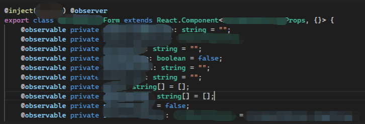

> Note: This code is from a internal project. To protect confidential information, some details are hidden, but the investigation and methods mentioned in the article are still worth reading.

# The Problem

I was working on a form that had very poor performance. Specifically, every time a key was stroked down, the form responded pretty slowly. What's worse, the component and the whole website became unresponsive for **seconds** if several keys were stroked sequentially (like input a long number), which was, unfortunately, the normal use case for this field.

# Investigation

## Validations?

From the gif provided above, you may find some details that are worth taking notice of:

- The first field had the **worse performance**,
- The first field had some kinds of input validation (loading indicator when the first inputs were registered),
- The field below the first field had better performance than the first one, and it had no validation.

Hmm...It looks like **the validation** might be the cause.

However, the validation process was merely some format check, and a request which would be cancelled if next key stroke had come before it completed. It did increase the delay of input, but should not be so significant.

## Re-renders of the whole form?

### The Challenge of forms in React

The **re-render of the whole form at every input** might be the problem as well.

React has been known as *not good at implementing forms* because of its famous **unidirectional data flow**.

Unidirectional data flow simplifies the data flow and fits seeminglessly with the concept of React. However, since **each update to the state will trigger the component to re-render**, it might be source of performance issues in some cases.

Form is one of such cases, because a form consists of multiple input fields, and each input to any one of them would update the state, and re-render the whole form and every other fields. Therefore, writing forms in React has always a challenge.

Looking at the code, the form is implemented in a very React fashion: the form contains all the fields, and handles every `onChange` event for each input fields.

### Complicated Form

The form is pretty complicated as well with dozens of fields, several **sync/async and cross-field validations**, **dynamic placeholders** and some unnecessary **duplicate calculations** (which can be replaced with constants and cache).

It seems pretty evident that the **re-renders** and **the complicated calculations** during the render are the cause to the problem.

### No Easy Solutions

However, the reason that form implementation is called a *challenge* in React is that it can not be solved easily. There are lots of React form library from the community (like [react-form](https://github.com/tannerlinsley/react-form), [formik](https://github.com/jaredpalmer/formik)) trying to solve the form as a whole by providing a complete solution to some common form challenges, including input management, async validations, and submission. They may be viable for many users and should be considered if you are having trouble building a form in your project, but I cannot adopt them in this project becauses:

- hiding complexities usually means introducing other complexities
    - for example, when using the libraries, more problems are introduced, like **less flexibilities**, **less understandable code**, **interop with UI libraries** and **the cost of learning and adopting a new set of APIs**.
- I don't have confidence to rewrite the login behind the code correctly in a short time;
- introducing a new library into this project is hard (it is a internal project that has over 200K lines of TypeScript code, hundreds of authors and users, so the review for this project is strict).

### Maybe not re-renders?

Besides, my experiences told me that it was possibly not the **re-renders** that ultimately caused the problem, since the update of the form should not be so costly that would result in such a significant delay.

I have encountered situations where even **a whole page** re-rendered at every interaction, but React and modern JavaScript engines had made it run smoothly without even a stutter. This form was complicated, but should not so that causes the problem.

## Profiler to the rescue

