# 从三年前Xubuntu开始

想当年大一的时候，由于当时所有预算都投入到游戏本上了（这仍然是我目前最后悔的一个决定，要是当时能直接上台式机，性能能提升很大一个层次），所以外出只能带一台三代i3的联想Yoga笔记本来应付（要是没记错的话，应该是Yoga 11s，2013年的产品了）。虽然这是台预装Windows 8的标杆型翻转屏设备，但是在低压三代i3+4G内存+128G SSD这可怜的配置下，做点普通的工作，性能和存储空间都有点捉襟见肘。于是，当时我萌发了装Linux来省空间、以及让系统运行地更快的想法。当时我安装了[Xubuntu](https://xubuntu.org/)，默认安装轻量的[Xfce](https://www.xfce.org/)桌面环境（而不是当时Ubuntu默认的Unity），运行速度确实比跑Win8要高一个档次，同时能准备拿这机会熟悉熟悉Linux。当时计基的作业我还是拿这台装有Xubuntu的电脑去检查的，感觉逼格满满。但是后面没多久，这电脑实在有点支撑不了在外面写作业编程的需求，所以假期之后就换成了一台稍微能用一点的低压五代i7的一台联想扬天，后面也没拿实体机装Linux玩了。

这个假期，闲来无事，看着都已经有点审美疲劳的Windows 10，我又想开始折腾了。

# Manjaro好

装Linux的第一步当然是选择发行版。对于很多人来说，Ubuntu一定是他/她第一个接触和尝试的Linux的发行版。但是我还记得在当年用Ubuntu的日子，**装软件麻烦**（什么PPA什么的）、**容易挂**（你敢相信我装了系统第一次升级之后，系统就各种冒出各种内部错误的提示吗？）等问题让我对它的印象不怎么好。

通过找搜索了下资料，我发现目前网络上对[Manjaro](https://manjaro.org/)这个发行版评价非常高，尤其是对它继承于Arch Linux的`pacman`包管理工具和`AUR`，大家都表示好评。这不正好解决了我的第一个麻烦了吗？至于容易挂这个问题，通过了解，虽然Arch是滚动更新（即不像Windows, Ubuntu, macOS等主流的系统会每隔一定时间发布一个大更新包），但是只要更新及时，一般也不会造成太大的问题，并且Manjaro也通过把Arch的包延迟2周来尝试解决滚动更新的问题，所以我对这个问题也暂时没怎么考虑。

选择了Manjaro后，我又发现Manjaro提供了很多预置的桌面环境，[官方支持](https://manjaro.org/download/#official)的都有`KDE`, `GNOME`和`Xfce`三种桌面环境。经过了解，`KDE`似乎是从功能到界面最完善的桌面环境；而`Xfce`就和当年一样，注重轻量级和效率；`GNOME`介于两者之间，但是似乎有不太好的名声。想到我目前的电脑也不弱（X1C 6th），于是就选择了`KDE`，看看目前Linux的“最好”的桌面环境怎么样。

于是，8月份，我选择了`Manjaro KDE`作为几年来我第一个尝试的Linux发行版。

# Manjaro KDE

KDE的第一印象还是非常不错的。界面确实比较好看，功能也比较完善，甚至还有手机的KDE Connect App可以把电脑和手机相连，体验了一下功能还是可以用的（MS的Your Phone……不知道为什么一个连手机的App还要限制区域）。各种应用也比较齐全，Arch的软件包管理确实名不虚传，只需要配置一下源、安装一下keyrings就可以直接`pacman -S`安装很多软件；不够的话，还可以用`yay`等一些工具装`AUR`上面的各种各样的软件；还可以用`archlinuxcn`源装一些国内的应用，比如网易云音乐、QQ什么的，确实非常方便。对于HiDPI也有不错的支持。其中QQ的配置需要强烈感谢 https://www.lulinux.com/archives/1319 ，有兴趣的同学可以去看看这篇文章。

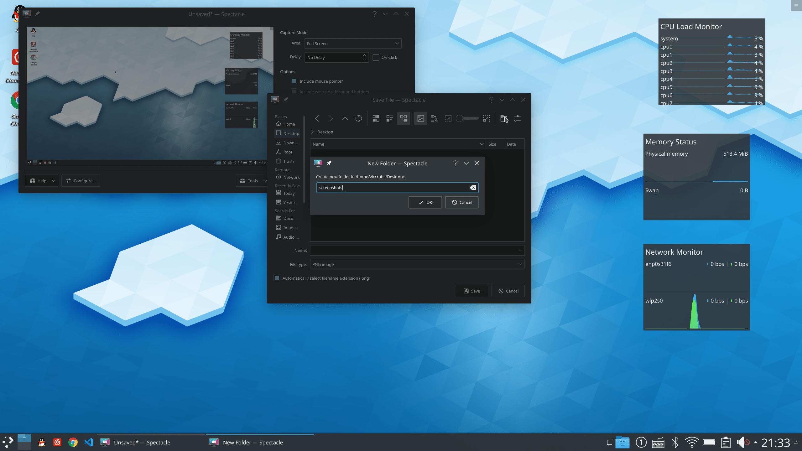

但是HiDPI也有问题：deepin分发的QQ不知道为什么依赖了`gnome-settings-daemon`这个GNOME桌面的依赖，要想在KDE上运行，则需要单独安装这个包。但是呢，这个安装这个包会影响KDE的DPI设置，**造成KDE的字体设置会无效**，让基本所有地方的字体都过小，且无法变大。

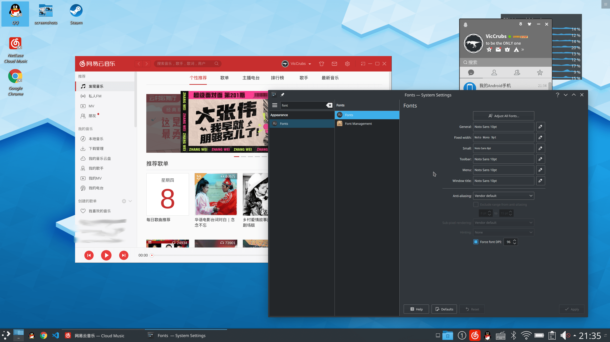

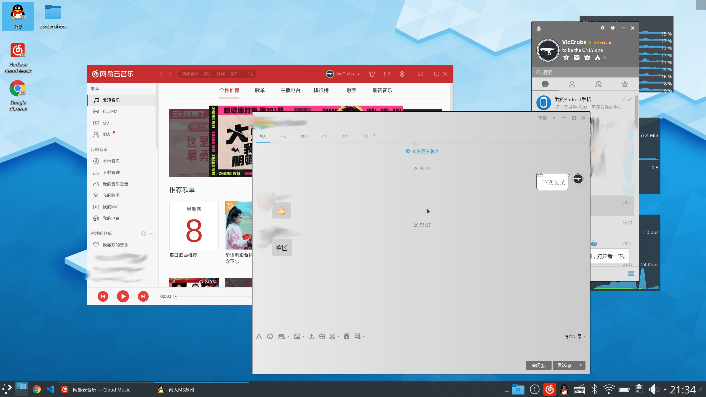

这个影响其实比较大的，因为这造成基本所有的地方的字体都变得非常小，很难看。这个问题也在GitHub有跟踪([Issue](https://github.com/wszqkzqk/deepin-wine-ubuntu/issues/90)以及它reference的一个issue都是这个相关的)，目前好像也没有什么好解决方案。

# Manjaro GNOME

KDE其实感觉挺舒服的，但是似乎没有办法解决GNOME和KDE冲突的问题，机智的我突然想到：**要是我直接用GNOME，不就没有冲突的问题了？**

于是下载了GNOME版Manjaro。进了系统后发现字体太大，一进显示设置就傻了：居然只支持整数倍缩放……

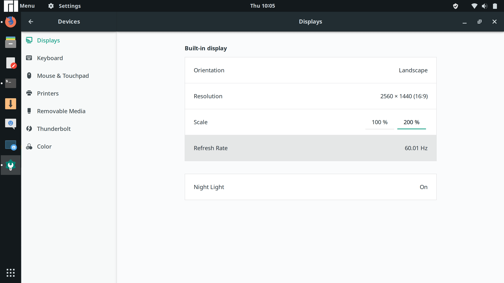

当网络上都在喷Window HiDPI的时候，没想到GNOME，这个这么流行的桌面环境不支持非整数倍缩放……从网上搜索GNOME从2017年就开始做[分数倍缩放（fractional scale）](https://wiki.gnome.org/Initiatives/FracionalScaling)，但是到现在都没能完全支持。网上有一些办法据说可以打开分数倍缩放的功能，但是我都没有成功过，不知道为什么。

# 放弃...一段时间

在折腾的时候，我发现Manjaro确实解决了之前我提到的**软件**和**更新**的问题。软件安装方便，更新也是基本无缝了，没有再有什么更新一次就内部错误这种问题……而且整个生态环境也更加地完善了，感觉**如果没有腾讯毒瘤**的话，Linux作为日常和开发使用应该问题不大。

但是在折腾GNOME后，感觉有点累觉不爱了。这时正好我在实习，晚上一般都在主力机面前看看视频打打游戏啥的，也不想再折腾Linux了。

直到……

# 平铺式窗口管理器（Tiling Window Manager）

一个偶然的功夫，我听说了[平铺式窗口管理器 (Tiling Window Manager)](http://en.wikipedia.org/wiki/Tiling_window_manager)的概念。

根据我的了解，目前Windows, macOS, KDE, GNOME等绝大多数**浮动式窗口管理器（floating wm）**，默认把各个窗口像一个一个卡片一样**堆叠**在桌面上，各个窗口可以随意拖动改变位置和缩放大小，之间可能有重叠。而平铺式窗口管理器把各个窗口**平铺**在桌面上，各个窗口之间**没有重叠**，以**尽可能利用屏幕空间**。并且，各个窗口间没有重叠，配上**workspace**（即虚拟桌面）的概念，也方便自己在打开的超多窗口中快速找到和切换到自己的想要的窗口。

另外，平铺式窗口管理器一般还会有一个特征，即**可以用键盘完成所有操作**。例如在i3里，可以使用Win或者Alt+其他快捷键完成**打开终端**、**打开浏览器**、**打开dmenu等任务启动器**、**切换目前激活的窗口**、**缩放窗口**等所有操作。当时我刚学会用vim，感到纯键盘确实可以带来一些效率的提高，而这个纯键盘操作确实相当吸引我。

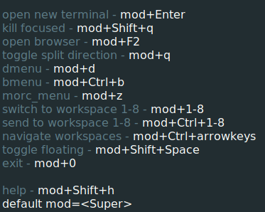

# Manjaro i3

i3是一种比较典型和简单的窗口管理器，它不仅有以上的所有特征，而且**配置简单**（全在一个配置文件里），功能也还算比较全，而且[默认支持HiDPI](https://faq.i3wm.org/question/3623/hi-dpi-support/index.html)。Manjaro i3也配了一些例如`urxvt`等辅助工具，安装好之后整个系统还算比较完整。

但是尽管这样，经过上次直接在实体机上折腾Linux的教训，这次我学乖了，先开了个Hyper-V虚拟机来配置下试试，看看效果。推荐一下这个YouTube上配置i3的[系列教程](https://www.youtube.com/watch?v=j1I63wGcvU4)，讲得非常清楚，跟着做确实也能系统配置得像模像样的。另外，也尝试了下QQ等软件的效果，虽然是平铺窗口管理器，但是也可以手动、或者根据配置文件对对应app切换到浮动式显示，这些软件在i3的显示效果也还是可以接受的。

于是，一狠心，我就把Manjaro i3装到实体机上了。复刻了一些配置，以及安装一些软件之后，整个体验确实很不错。甚至[FreeOffice](https://www.freeoffice.com/en/)标榜和MS Office无缝兼容，Office在Linux上也能正常编辑了。

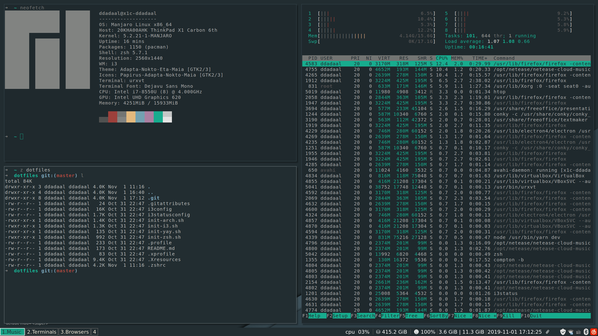

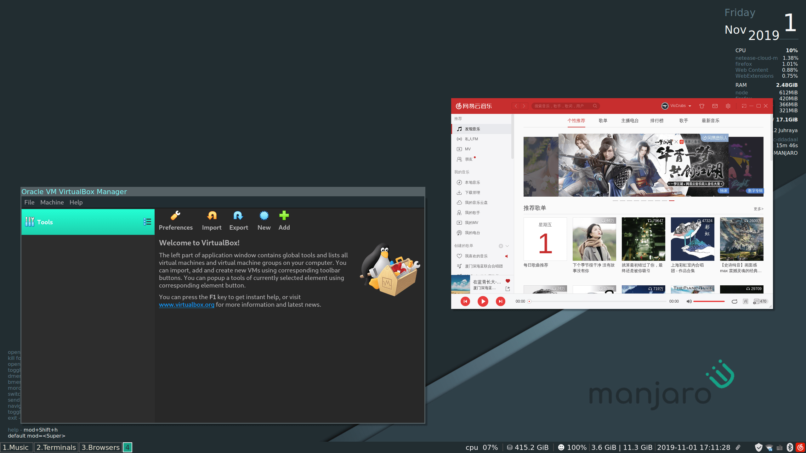

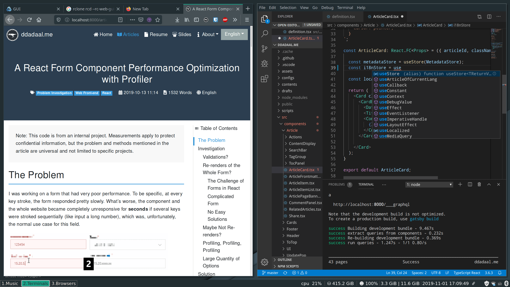

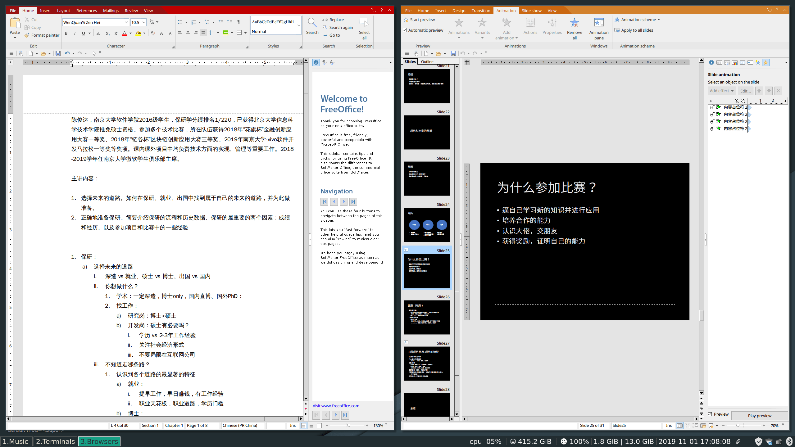

## QQ

但是呢，一旦到了QQ，事情又变得难受了起来。

10月24日，时隔上次更新**10年**后，QQ居然更新了[Linux QQ](https://im.qq.com/linuxqq/index.html)。虽然界面上看上去挺原始的（北京申奥成功了！！），但是还是一大进步，而且根据“有原生用原生”的理念，我第一选择是看看原生QQ在i3上体验怎么样。

不装不知道，一装吓一跳：**不支持HiDPI**、**消息弹窗被遮挡（注意右下角，把QQ的图标移到最左侧可以解决这个问题，但是也是比较麻烦的）**、**忽略了消息屏蔽**、**字体和背景颜色**等问题让我几乎不能正常使用QQ……果然是10年前的代码拿出来小改就用了……

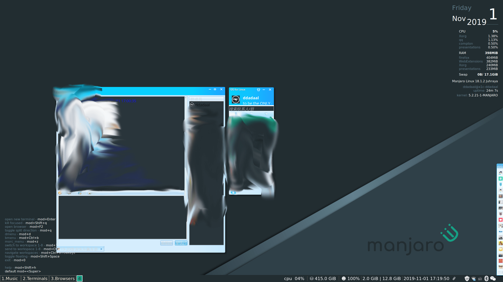

唉，原生QQ效果这么差，那试试之前尝试的deepin容器的QQ？结果在i3上遇到了KDE同样的问题：字体大小又被影响了（注意下图右侧的控制台字体）。另外，这些窗口的样式似乎也**被改变成了GNOME的样式**。注意下图Firefox的顶栏样式（和之前的图片进行对比）、包管理工具的窗口样式、以及右下角的图标，完全就是GNOME嘛！

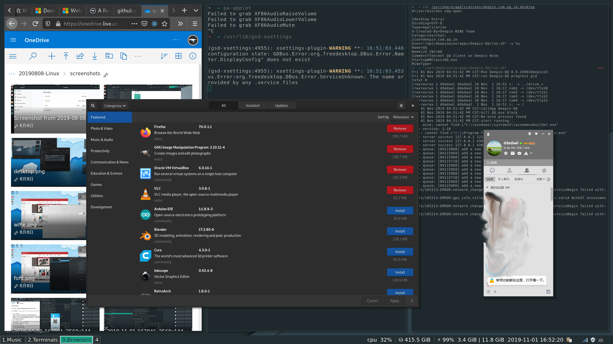

这些效果只要一运行`gnome-settings-daemon`就会出现，而且必须重启系统才能恢复，但是不运行`gnome-settings-daemon`又不能运行QQ，这就让人很为难了。

## 麻烦的配置

另外配置的过程也是非常的麻烦。虽然很多软件只需要修改一个配置即可成功配置，但是架不住**软件多啊**！每个软件配置的风格不一样（JSON, key-value等），而且各个软件配置更新后，让新配置生效的方法也不一样，记住这么多不一样的配置方案也是挺累的。

- `urxvt`在`~/.Xresources`里
- `i3`在`~/.i3/config`里
- `i3status`默认没有，需要把`/etc/i3status.conf`复制到`~/.config/i3status`里
- `vim`在`~/.vimrc`
- `zsh`在`~/.zshrc`
- `pacman`的mirrorlist在`/etc/pacman.d/mirrorlist`，但是源的配置又在`/etc/pacman.conf`
- `sha***soc*s`在`/etc/shadowsocks`
- `proxychains`在`/etc/proxychains.conf`
- ...

而对于一些我们理所当然的东西，比如输入法、音频、网络等，很多也要自己配置才能正常使用。输入法`fcitx`是比较简单的，音频、蓝牙等这些本来以为理所当然桌面会给处理的工具，现在都要自己安装和配置，一不小心就是乱码、报错。这不，想把alsa升级到pulseaudio，一不小心，pulseaudio又挂了，而且archwiki也找不到解决方案。之前我还在没有安装其他命令行模拟器的情况下把`urxvt`给配置炸了（字体设置错了），结果终端直接无法启动了，没法改配置文件；而不能改配置文件，终端也启动不了，这样陷入了僵局。

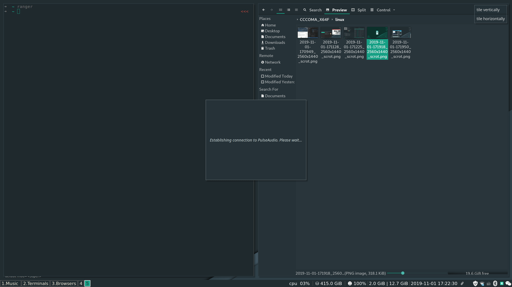

i3虽说比较灵活，配置起来也比较简单，但是很多事情也是需要自己动手的。例如说像之前说的让一个软件自动变成浮动而不是平铺，虽然只需要在配置文件里增加一行，但是对于每个软件都得自己处理，也是一件非常耗时间的事情。但是要是不处理呢，很多软件显示的效果……不说了，自己看下图。

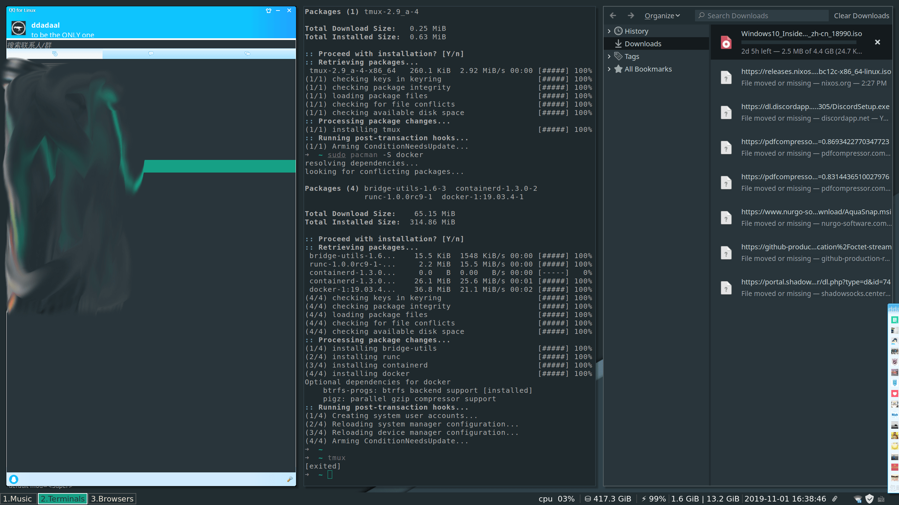

## 纯键盘+平铺式一定是最有效率的吗？

另外一点是之前说的最吸引我的一点：**纯键盘操作**。不可否认的是vim类似的键盘快捷键给敲代码提高了很多的效率。但是键盘也不是在所有场合都是效率最高的。在一些日常场景下，键盘+鼠标更能提供效率，例如：

- 调整窗口大小
  - i3：`$mod+r`，然后通过`jkl;`四个按键调整窗口大小
  - 浮动式：鼠标放到边框，直接拖动
  - 浮动式更精确，更快速
- 调整窗口位置
  - i3: 快捷键，具体我忘了……
  - 浮动式：拖动
- 操作文件（以复制文件举例子）
  - 命令行：`cp /path/to/source /path/to/dest`
  - GUI：打开文件管理器，找到路径，选择文件，`ctrl+c`，找到路径，`ctrl+v`
  - 看起来命令行更快更简单，但是命令行输入路径是需要**自己一个部分一个部分地输入**的（tab也只能补全一个部分），但是文件管理器不需要自己输入名称，而且GUI也会提供一些快捷方式（比如直接进入桌面、U盘目录），速度其实并不比打命令慢。而且在多选、复制之前确认文件等方面GUI也是非常方便的
  - 在普通的管理文件时，GUI由于支持**拖动**，其效率也常常比需要自己打至少一部分文件名的命令行更有效率
- 操作GUI软件
  - 键盘：？？？
- 操作蓝牙/WiFi等**涉及列表**的操作
  - 命令行（忽略第一次搜索如何连接）：`bluetoothctl`，`scan on`，找到地址，`connect {地址}`
  - GUI：点击搜索，选择设备，右键连接
  - `bluetoothctl`要我自己输入地址是在逗我吗？？:angry:

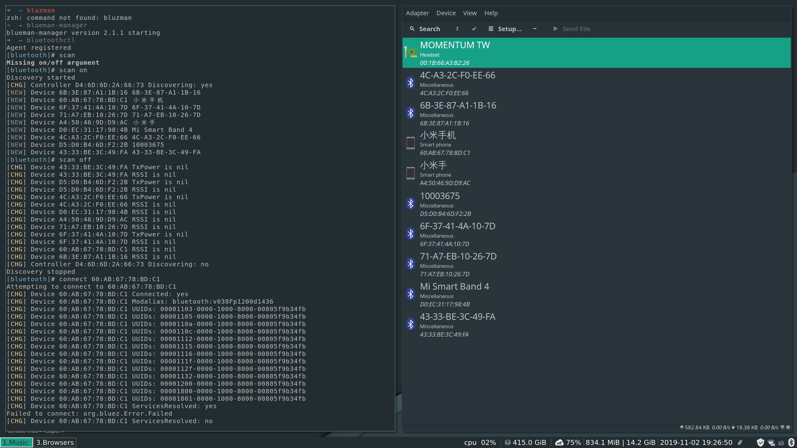

另外，即使我们认为用户都能记得这么多命令和参数，但是在使用命令行操作时，需要自己输入各种命令、参数、选项，在整个操作的过程中，**人的精神是紧张的**。如果操作都使用命令行进行操作，用户很容易感到**疲惫**的。更别提用户第一次操作时完全不知道使用GUI操作时，需要`--help`, `man`, `archwiki`等在各种浩如烟海的文档中找到自己需要的操作在命令行中应该怎么写，这也是非常耗时间和疲惫的（这里吐血推荐`tldr`，短短几行告诉你命令怎么打，大多数情况下就不需要去几十页的`man`里找到自己要的几个字母了）。而使用GUI操作的时候，即使效率不如键盘，但是在整个操作过程中用户只需要操作鼠标以及简单地输入少数字符，**整个用户体验会比命令行舒服，用户也不容易感到疲惫**。

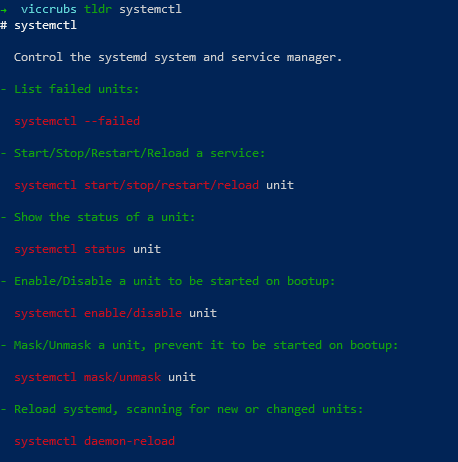

当然了，在那些需要效率的地方当然命令行更能提高生产力，但是用电脑也不是要一直要保持高效率吧？而在i3这种平铺式窗口管理器上，只使用鼠标几乎什么都做不了，这就对我这种懒人造成一些挑战了。

对于平铺式窗口管理器的批评，我个人认为这个YouTube视频 [Tiling Window Managers suck. Here's why](https://www.youtube.com/watch?v=5n_rl9jWUMo) 里说的几个点还是比较有道理的，感兴趣的同学可以看看。

# Arch Linux

大家都说Arch Linux装一次要几个小时，甚至认为Arch Linux不提供图形安装界面就是为了筛选用户……在折腾i3的过程中，我也尝试过直接安装Arch Linux，并且我在虚拟机上成功了。确实Arch Linux的ISO不提供图形安装界面，一进去就是命令行，分区、引导啥的都得自给自足（`fdisk`和`grep`），确实有点劝退，但是跟着archwiki上的[官方的Arch Linux安装教程](https://wiki.archlinux.org/index.php/Installation_Guide)走，基本可以走完安装全过程，再配上[比如这个教程](https://itsfoss.com/install-arch-linux/)查漏补缺，走完安装，进入系统其实问题也不是很大。但是后面的各种折腾就因人而异了……Manjaro装完起码提供了X11，Arch装完连X11都没有，什么都得自己弄，遇到问题也得全网搜（比如我的这个系统，X11性能特别差，鼠标移动都有延迟，我也最终没有找到能用的解决方案）。Arch确实很适合一些什么都要自己操作的用户！

# Windows 10

最终我还是回到了Windows 10，毕竟目前最好的Linux发行版是Windows 10（误。在Windows 10上通过WSL也能享受到和Linux差不多好的命令行体验，即使有一些IO等问题，但是使用体验已经非常接近了。并且等到20H1发布后，就有了完整的Linux内核了，那时候，Windows == Windows + Linux，使用一个系统就能享受到了两个系统的好处，岂不妙哉？

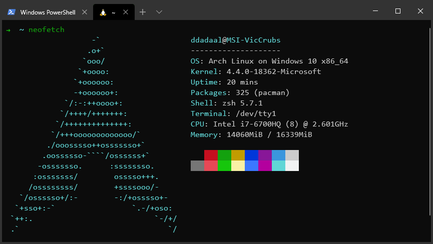

# 总结+建议

你可能会觉得我会感慨一下然后以后就再也不折腾了？naive。折腾是不能停的！吸收各家所长，扬长避短，才是最吼的。所以以后呢我还会继续折腾各种各样的Linux发行版（甚至试试BSD :joy:），但是可能以虚拟机为主。毕竟Windows作为一个更加成熟的操作系统平台，更能满足我各种各样的需求。

另外，如果你也想折腾Linux，不管是虚拟机还是实体机，这里给三个建议：

- 学习vim

如果你学会用vim，操作Linux中各种各样的配置文件将会变成很简单的事情。并且学会vim也能帮你打代码的时候提高效率。当然了，学vim的副作用就是以后做什么事情都想用vim的快捷键 :joy:

- archwiki

[archwiki](https://wiki.archlinux.org/)真的是个好东西，其内容之详细、实用让我叹为观止。很多不仅限于Arch的Linux相关的问题都可以archwiki上得到解答。

- 不要怕麻烦

毕竟Linux就不是给懒人准备的。多查资料、多尝试、多写自动化脚本，尝试找到一个让自己用起来舒服的配置。

最后，这里放一下我的[dotfiles](https://github.com/ddadaal/dotfiles)。里面也有一些配置脚本，可以用来快速初始化一个manjaro, zsh或者Arch on WSL系统。
