# wslg

Build 2020上微软给大家画了个饼，说官方正在做WSL2的GUI和GPU支持，这让我激动得不行。

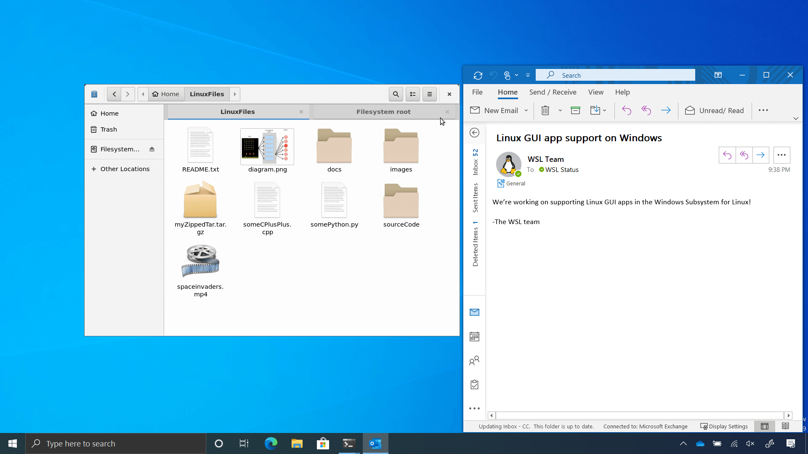

大家都知道一些常见开发工具在Windows上运行效率很低（如IDEA的启动速度在Windows上速度比Linux下慢了1倍（[相关文章](/articles/from-vscode-to-vim-to-both)））。

要是GUI和GPU都能用了，那WSL 2和Linux用起来还有什么区别？开发工具在WSL2跑，其他软件在Windows上，best of two worlds，岂不美哉？Linux桌面受到致命打击。

没想到这一等就是一年。最近微软终于放出了官方的GUI解决方案wslg的预览版（[GitHub](https://github.com/microsoft/wslg)），可以在Insider build上公开测试了。

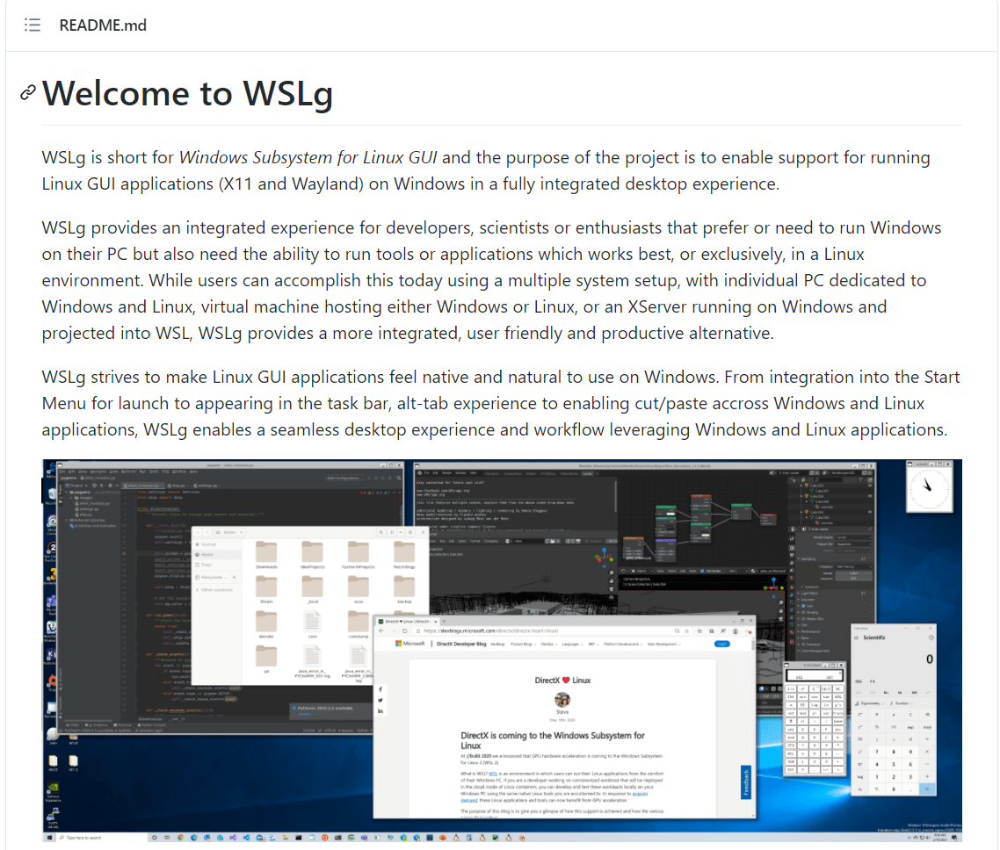

当然了，我马不停蹄地格掉了一个移动SSD，装上了Windows 10 Insider Dev版，开始测试。

# 环境要求

仓库里说，系统版本要求为21362或以上，还推荐安装一个更新的显卡驱动。

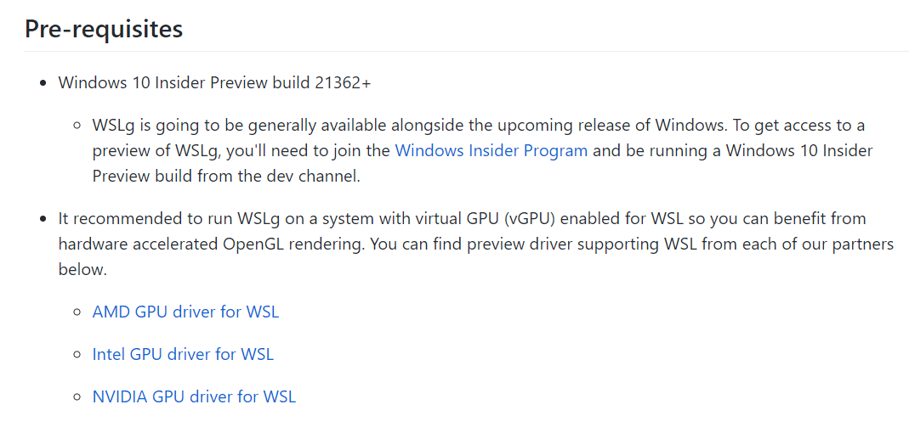

我本机是RTX 3070，于是就安装NVIDIA版本的。从NVIDIA官方网站可以看到，这个显卡驱动允许了WSL2使用GPU跑CUDA，使得需要GPU的计算任务（比如机器学习）也可以直接在WSL2上跑。这使得大家以后可以在Windows下跑机器学习了，Linux桌面再次受到致命打击。

直接从Windows Insider下载下来的ISO是21354版本的，还需要更新一次系统才能到21362+。更新之后为21364，可以正常运行wslg了。

接下来都是在截止2021/4/23能够获得的最新的Windows版本（21364）和wslg版本1.0.17上体验的。由于还是预览版，所以很多功能不能用都是正常的

# 安装WSL2，运行GUI程序！

现在安装WSL2很简单，不需要去控制面板里自己打开各种功能，只需要运行`wsl --install`即可安装WSL2的所有部件（已经安装好了没有截图）。

我们先拿[使用X11 Forwarding在WSL 2中运行GUI程序](/articles/run-gui-on-wsl2-with-x11-forwarding)中提到的几个软件试试水。

安装饼直接运行`xclock`，一个时钟出现了！

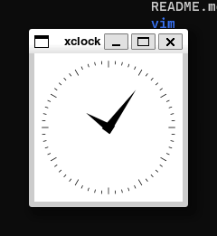

ohhhhhhh！无缝体验，不需要再去折腾什么`DISPLAY`环境变量，Windows的X Server，直接运行就可以了！

然后我们再用个复杂一点VSCode进行测试，也能正常运行。

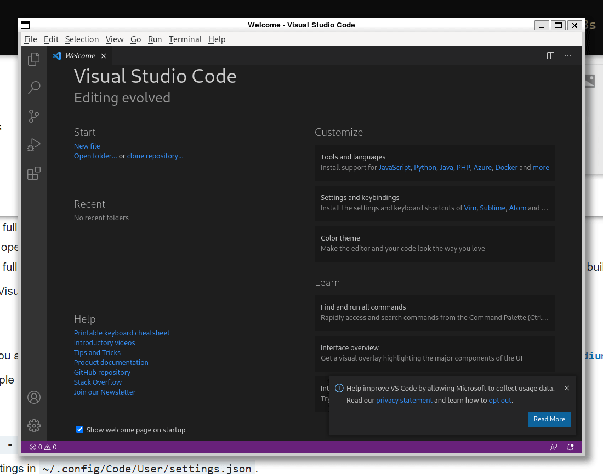

把VSCode的`titleBarStyle`设置为`custom`后，使用`vcxsrv`的方案不能拖动窗口，但是wslg方案可以正常拖动。

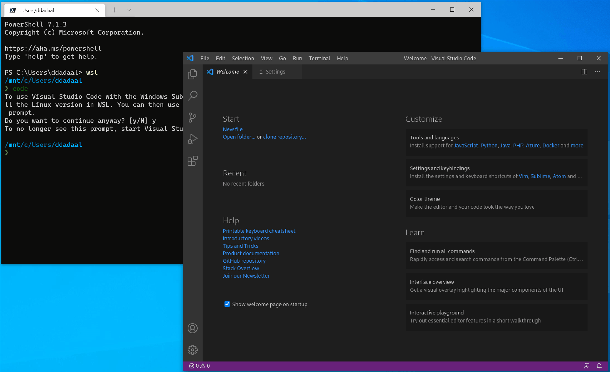

再启动一个网易云音乐，可以发现音乐也可以正常播放。根据wslg的主页，wslg也通过对音频输入输出有完全的支持。

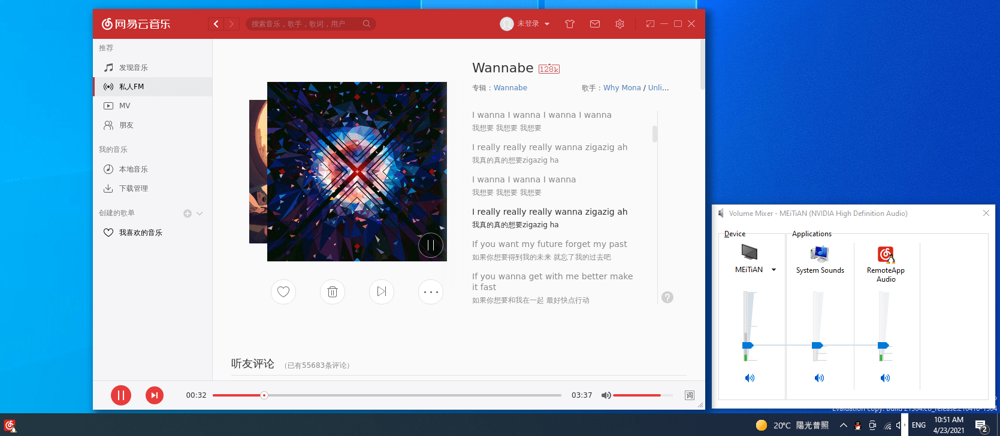

剪贴板也是双向同步的。

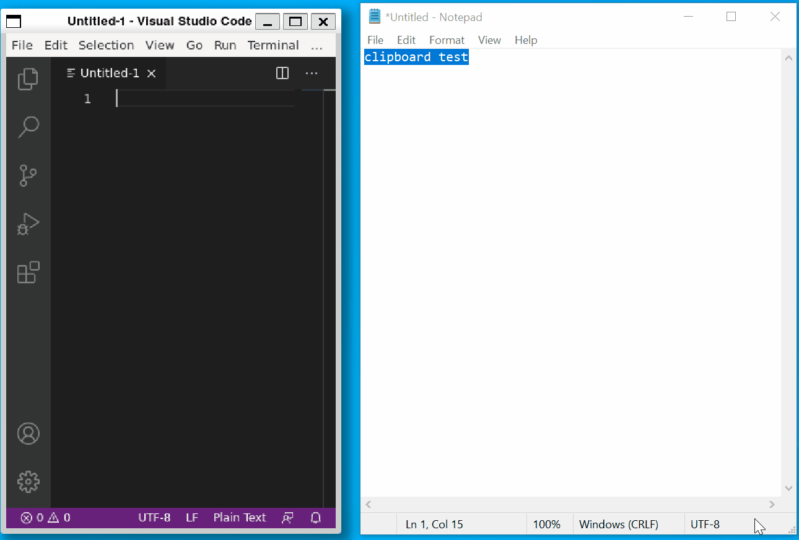

看起来很promising啊！

# 发现的问题

兴奋没一会，就发现了不少问题。这些问题使用官方的Ubuntu发行版也没有解决。

## 高DPI

我的显示器4K分辨率的，平时开的150%缩放，直接打开应用可以发现是糊的，看起来并不支持DPI缩放。

去Issues里查，确实有相关Issue（[#23](https://github.com/microsoft/wslg/issues/23)），里面提供了一个打开这个功能的解决方案，但是结果确实更糊了……

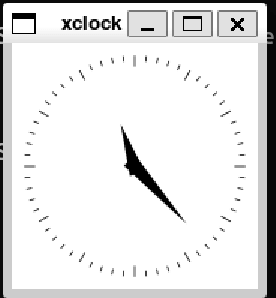

上面的拖动VSCode的动画打开这个功能后录制的，也可以看出VSCode已经糊得看不清了。

这看起来应该是个bug，因为已有的vcxsrv可以很完美地实现缩放。

## Windows IME支持

我在文章中提到IME支持的问题。Linux下配置输入法也是一件比较麻烦的事情，如果能够直接使用Windows这边的输入法在Linux程序中输入程序，就会极大提高用户体验。

很遗憾的是看到当前版本的`wslg`仍然不支持直接使用Windows的输入法在Linux下进行输入。不知道微软有没有发现非英语国家的开发者确实有这个需求，如果以后可以做就更好了。

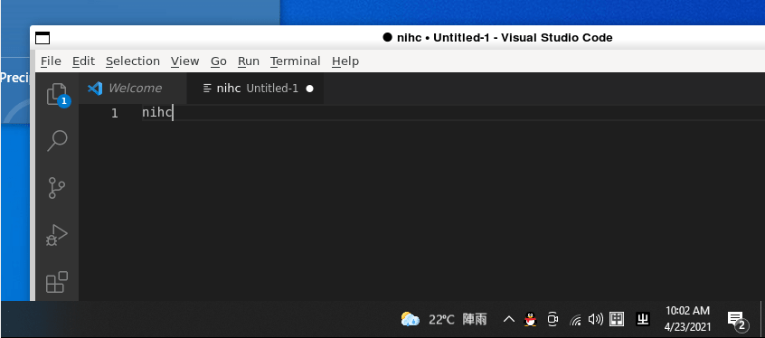

但是实在想要IME的话，还是可以直接在Linux下配置IME，虽然有点小问题（[#8](https://github.com/microsoft/wslg/issues/8)），但是总比没有用好嘛。

## QQ截图使wslg崩溃

这是个很奇怪的bug。看下面gif，一开始使用Windows自带的Win+Shift+S截图没有问题，但是如果使用QQ截图，就会使得当前Linux程序崩溃，无法重新启动，即使重启WSL都不行，需要重启整个Windows才能解决……

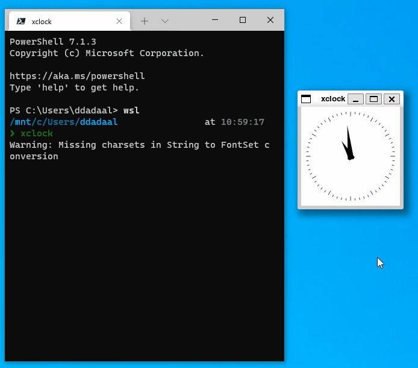

# 其他发现

除了这些问题，我还有一些其他发现：

1. 现在的WSL2内核已经升级到5.10了，这比之前的4.19提高了不少。虽然用起来并没有什么不同，但是对于版本强迫症的我来说是一个极大的安慰。

2. 开始菜单里每个发行版的文件夹里会显示所安装的程序，个人猜测是读取desktop文件的。另外，Ubuntu里的程序是有图标的，Arch里的没有。Ubuntu不愧是有官方背书的（

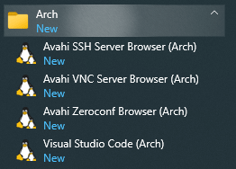

# 总结

可以发现，有了wslg，Windows朝着最佳Linux发行版又跨了一大步。虽然现在的wslg还有很多bug，实际效果可能和普通的Windows的X Server相差不大（甚至目前还不如，比如HiDPI支持），但是由于wslg有官方背书，可以预见到wslg正式推出后，Windows将会越来越像Linux。无缝的GUI体验，开始菜单的集成，GPU计算……通过WSL2和wslg，Windows完全兼容了Linux生态，Linux能做的Windows都能做，而反过来现在不行，可能以后也永远不行。
