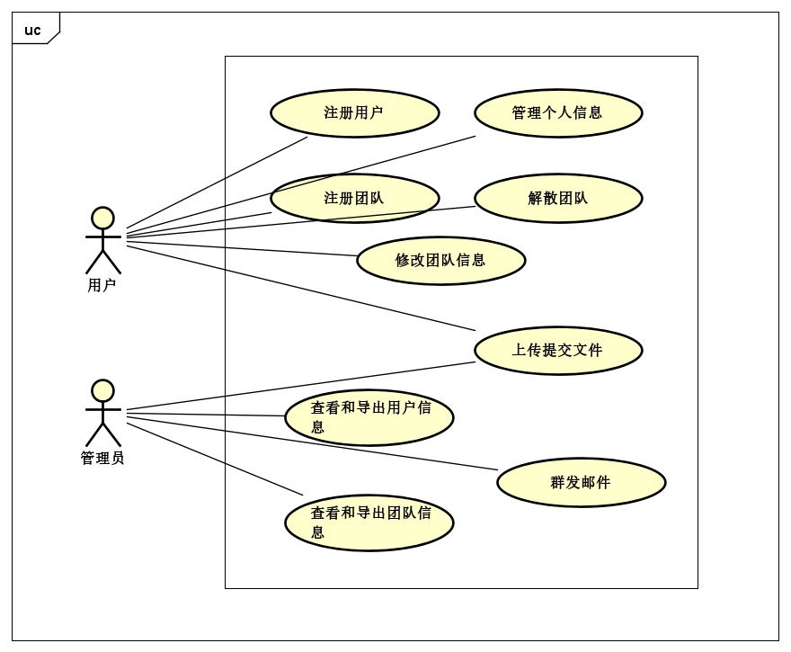
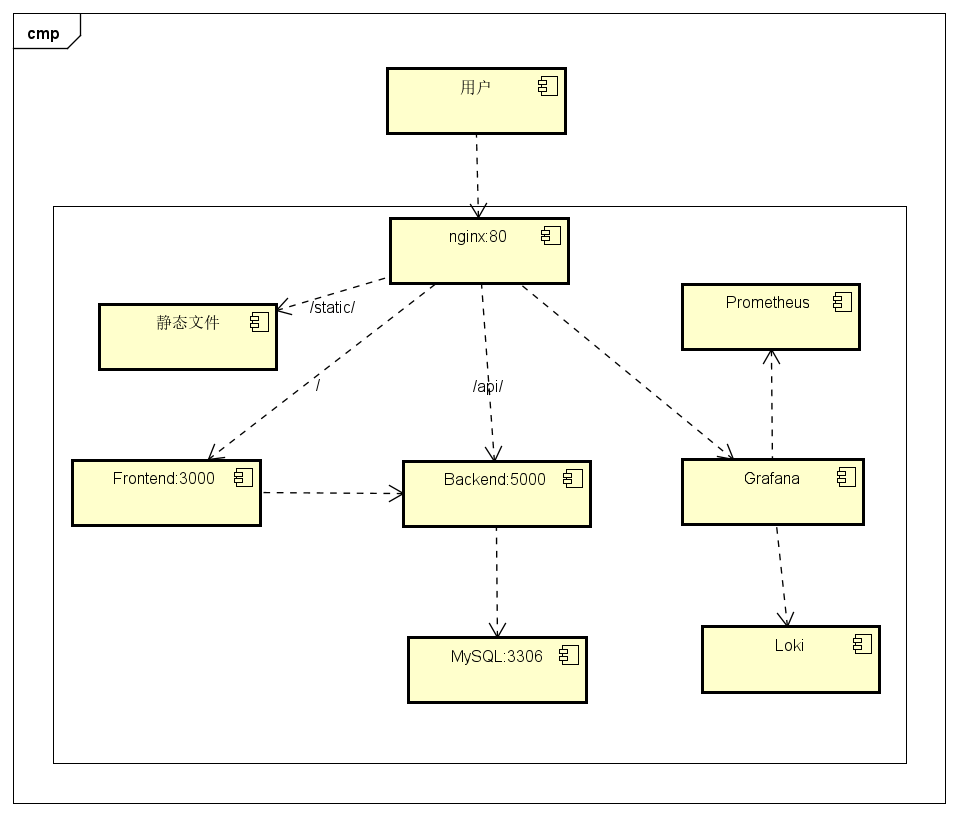
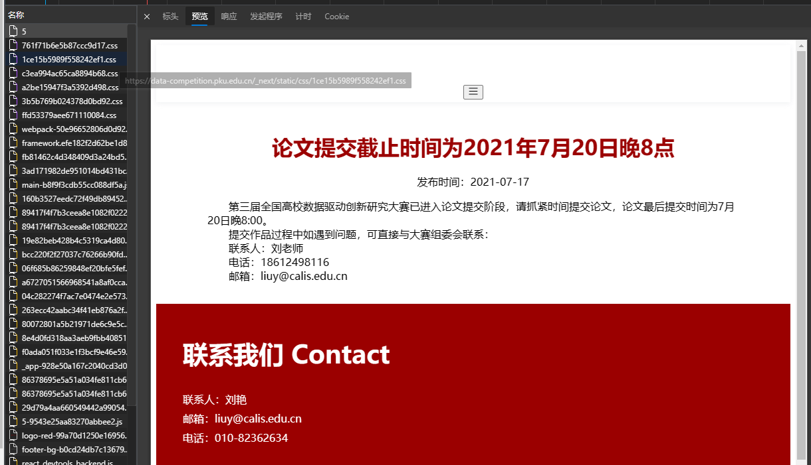
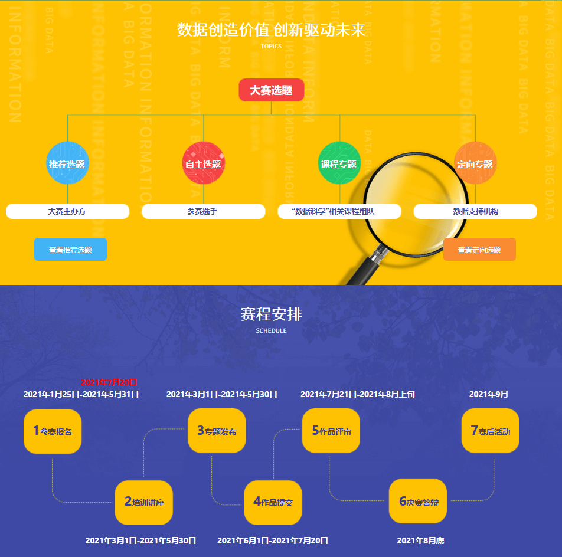
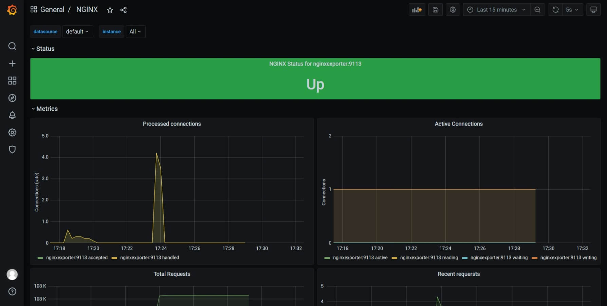
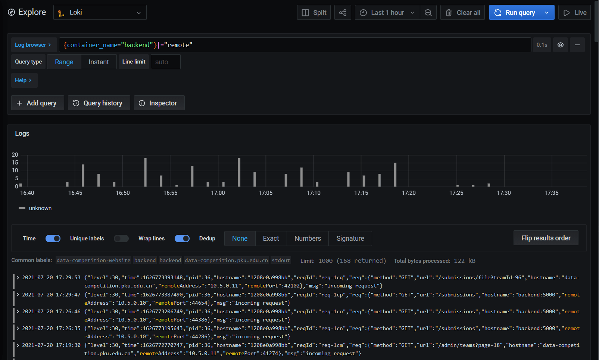
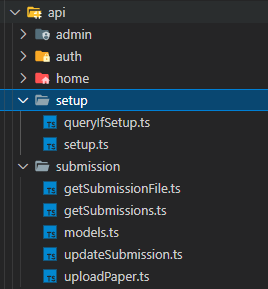
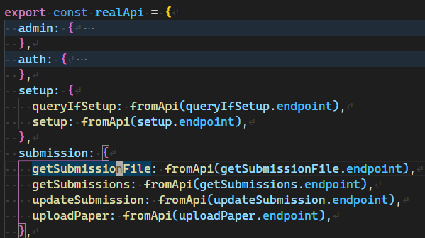

# 我的第一个真实项目

终于，从3月15日开始，我自己独立承担了一个完整的、真实的项目的开发和整个软件生命周期的维护工作：https://data-competition.pku.edu.cn ，第三届全国高校数据驱动创新研究大赛的后台系统（代码目前放在学校gitlab上，以后应该会把代码放到github上）。

虽然这还是一个常规的CRUD项目，但是毕竟是我第一个能够被真实用户使用的系统，我还是比较激动的。项目中途遇到了几次重构，最后出现了一次生产事故，其他的总体流程还是比较顺利的。

项目现在已经基本结束了，这里写一篇总结文，介绍一下项目的架构、演进、自己设置的一套前后端共用API的机制、以及在这个过程中的经验。

# 系统功能、架构、规模

下面是系统的用例图，主要完成一个比赛报名系统的用户管理、团队管理和上传提交文件操作，还对管理员实现了查看用户和团队信息以及群发邮件功能。



总的来说，系统是一个做了SSR的前后端分离的TypeScript全栈项目，下表为项目的技术栈。

| 部分     | 技术栈                      |
| -------- | --------------------------- |
| 编程语言 | TypeScript                  |
| 前端框架 | Next.js                     |
| UI库     | Ant Design                  |
| 后端框架 | fastify                     |
| 反向代理 | nginx                       |
| 数据库   | MySQL                       |
| 部署     | Docker + Docker Compose     |
| 监控     | Prometheus + Loki + Grafana |
| 外部服务 | 学校提供的SMTP服务器        |

下图是系统各个部分的架构图，监控部分其他的各个小组件就没有画了。



每个部分（包括nginx、数据库）都是使用容器运行，所有容器部署在一台2核2G内存的学校提供的虚拟机上。这个机器前面还有其他机器，负责SSL和开放到公网，所以这台机器本身是不能直接从公网访问的（连我上机器都需要使用VPN连接），这就带来了安全性：我可以使用最前面的nginx的来控制各个部分的可访问性。在我的配置中，nginx开放了80（前端）、5000（后端）和grafana的端口。grafana是否应该被公网访问我还不好说，但是由于grafana可以设置用户名和密码，应该安全性还好。

用docker运行的好处很显著：不管机器是什么样的，直接`docker-compose build`和`docker-compose up -d`就可以部署和更新了，以及loki也可以直接从Docker引擎中获取各个服务的日志。当然事实上没这么简单（数据库migration、volume mount等），后面要讲的生产事故也和docker直接相关。但是docker无疑是使得运维工作更简单的。

项目规模在12000行的TS代码左右。

```
➜  cloc . --fullpath --not-match-d="(node_modules|.next)"
     615 text files.
     610 unique files.
     296 files ignored.

github.com/AlDanial/cloc v 1.88  T=0.85 s (545.5 files/s, 92257.2 lines/s)
-------------------------------------------------------------------------------
Language                     files          blank        comment           code
-------------------------------------------------------------------------------
JSON                            22              1              0          41742
HTML                            96           1421              0          16873
TypeScript                     320           2470            440          12470
XML                              1              0              0           1390
CSS                              3             62             22            754
YAML                             6             26              3            260
JavaScript                       5             28             27            230
Bourne Shell                     1             12              6            164
Markdown                         6             76              0            162
SVG                              4              0              1            138
LESS                             1              2              0             14
PowerShell                       1              2              2              7
-------------------------------------------------------------------------------
SUM:                           466           4100            501          74204
-------------------------------------------------------------------------------
```

# 几次重构

## Create React App到Next.js

项目开始得比较急，以及我一开始询问得知**不需要做SEO**，所以采用了CRA开发了系统的第一个版本。结果后面又说需要SEO，所以只好将项目迁移到`next.js`。但是现在虽然已经能够做到SSR（下图），但是搜索引擎似乎也不好搜索到网页中的内容（可能是流量太低，搜索引擎还没有索引？）。



## 非响应式到响应式

和上面一样，一开始说系统并不需要考虑手机上访问，所以设计的时候就完全没有考虑手机端访问的情况。结果初版上线没多久就说需要支持手机上的访问，所以需要对网站做响应式的改造。

由于除了主页以外，之前本来就完全没有使用绝对坐标，所以其实很多元素已经能够自己适应了（例如网页的主内容部分），整体工作量比我想象的小。主要工作有两块：

- header
- 左右布局
- 主页

header整体是左边logo右边menu，但是右边的menu需要根据屏幕大小切换不同的布局。为了简单，我直接就对大屏幕和小屏幕分别写了两个Menu，然后在运行时根据当前的屏幕大小进行切换。

```tsx
import useBreakpoint from "antd/lib/grid/hooks/useBreakpoint";

const { md } = useBreakpoint();

md
  ? (
    <BigScreenMenu
      links={renderedLinks}
      pathname={pathname}
      userStore={userStore}
    />
  ) : (
    <SmallScreenMenu
      links={renderedLinks}
      pathname={pathname}
      userStore={userStore}
    />
  )
```

左右布局借用了使用的Ant Design的[Tabs](https://ant.design/components/tabs-cn/)组件可以显示在左边也可以在上面的功能，同样通过`useBreakpoint` hook获得现在屏幕的大小，然后通过大小判断Tabs的显示模式。

大屏幕下的界面：


小屏幕下的界面：


主页是比较麻烦的，因为主页有一些部分结构比较复杂，设计图的HTML里也主要是以1200px以上为基准，把一些复杂的结构使用绝对大小来表示。比如下图中的树状结构，就是通过绝对的margin值来确定位置的。



这个我最后取了一个偷懒的做法，就是在屏幕宽度过小的情况下，把这些复杂的部分全部隐藏掉。由于原来是支持1200px以上的，所以最后在1200px以下就把这些部分直接隐藏掉。

```css
@media (max-width: 1200px) {
  .part_04 {
    display: none;
  }

  .part_05 {
    display: none;
  }

  .part_06_01 {
    display: none;
  }

  .part_06_02 {
    display: none;
  }

  .part_07 {
    display: none;
  }

  .part_03 .moreOnPC p {
    display: block;
  }
}
```


## 部署Prometheus/Loki/Grafana

一开始系统并没有部署任何的监控系统和日志工具，日志全部直接打到stdout里，要查日志的时候通过`docker-compose logs {container name}`来查。这种方式有以下几个问题：

- 容器重启后，之前的日志就丢失了
- 只能看到raw log，只能借助一些外部工具（比如grep）进行分析，灵活性受限

另外在一开始，机器的硬盘很少（20G），由于我没有镜像仓库，docker镜像都是直接拉到机器现场build，产生了巨多storage layer，占用了不少空间，有一次部署因为硬盘不够直接build失败了。

所以我觉得需要部署一套监控和日志系统，用来在问题出现时更方便地寻找问题。后面选择了Prometheus和Loki和Grafana这一套组合。

网上抄了一些dashboard的配置，比如下面的[Node Exporter Full](https://grafana.com/grafana/dashboards/1860)，nginx等，但是可能由于我这个系统比较简单，请求压力也不大，这些机器只是看着炫酷，实际没有起到什么作用。




真正起到作用的是loki，通过使用Loki的[Docker Driver](https://grafana.com/docs/loki/latest/clients/docker-driver/configuration/)，loki可以直接收集容器产生的日志，并且支持在grafana中进行搜索和查询。这些日志在后面诊断生产事故时发挥了巨大的作用。



# 一次生产环境的文件丢失事故

在比赛临近结束、正在接受用户提交成果文件的时候，系统出了一场事故，丢失了一段时间内用户上传的文件。文章[一次生产环境的文件丢失事故：复盘和教训](/articles/summary-of-a-file-lost-accident) 详细介绍了这个事故从发现到确定影响范围到确定原因的过程。

# 经验

## 记录尽可能多的信息

在处理这个事故的过程中，后台程序记录的日志起到了巨大的作用。

同时，不仅是log，包括文件、数据库条目等保存的信息越多越好，能保存的信息尽可能保存，涉及到任何删除信息/文件等操作都应该谨慎。反正现在存储便宜，多用一点空间的成本和一旦发生事故造成的问题相比还是无关紧要的。

例如，在本项目中中为了节省磁盘空间和恶意上传文件，我设定了每个队伍只能上传一个文件，之后的上传会首先删除之前的文件。但是现在想起来，如果又有其他地方逻辑出错，把用户上传好的文件删除了怎么办？如果系统响应到一半被中断了，只删除了之前的文件，没有写入后面的文件怎么办？一切皆有可能，连字节跳动的实习生都能删掉机器学习模型，更何况我们这种没人审核代码的独立开发者？而至于防止恶意上传文件，也可以采用给团队能够使用的空间大小进行限额的方式来防止团队使用过多的空间，而不是一刀切地只能使用一个文件。

尽可能避免删除之前的信息，使得意外发生时，能够恢复到之前的状态，并且更方便去诊断问题。

## 前后端共享API定义

前后端分离中，接口是非常重要的。为了减少接口层次的不一致，这次系统使用了我在[yaarxiv](https://github.com/ddadaal/yaarxiv)中采用**前后端共享API定义文件**的设计。只需要在共享的`shared`项目中使用TypeScript写API相关的定义（request、response、权限等），前后端就可以使用同一份定义文件进行API的调用和实现。只要对每个接口写一个文件，以下所有工作都可以自动化：

- 前端
  - 调用接口时检查参数，推断返回值类型
  - 生成API Client
- 后端
  - 生成swagger
  - 检查请求参数
  - 编译时检查返回值类型

下面是一个真实的本项目中的API定义：更新团队成果信息来举例子，看看这个机制是怎么工作的。

### 定义接口

用户定义一个`xxxSchema`的interface，通过`body`定义request body的类型，`responses`中定义各个状态码以及对应的返回值。在定义接口的时候可以随意使用TypeScript的各种高级类型来减少重复。

定义好接口后，使用`endpoint`定义这个API的方法和URL以及对应的Schema类型，再使用`props`指定API的一些属性，例如要求的权限（`requiredRoles`），可以被调用的时间段（`timeRange`）等。

```ts
import { UserRole } from "../auth/login";
import { ApiProps } from "../utils/apiProps";
import { Endpoint } from "../utils/schema";
import { TimeOutOfRangeError } from "../utils/serverError";
import { Submission, submissionTimeRange } from "./models";

export type UpdateSubmissionModel = Omit<Submission, "teamId" | "leader" | "time" | "paper">;

export interface UpdateSubmissionSchema {
  body: {
    teamId: number;
    info: UpdateSubmissionModel;
  };
  responses: TimeOutOfRangeError<{ reason: "NotLeader" }> & {
    201: {};
    400: { reason: "DataUrls"};
    404: {}
  }
}

export const props: ApiProps = {
  requiredRoles: [UserRole.User],
  timeRange: submissionTimeRange,
};

export const endpoint = {
  method: "PATCH",
  url: "/submissions",
} as Endpoint<UpdateSubmissionSchema>;
```

这些都定义好后，在`shared`项目中调用`npm run api`生成一个json schema文件。后端将会使用这个json schema自动生成参数和返回值验证，自动对传入参数不合要求的请求返回400。

```json
"UpdateSubmissionSchema": {
  "type": "object",
  "properties": {
    "body": {
      "type": "object",
      "properties": {
        "teamId": {
          "type": "number"
        },
        "info": {
          "$ref": "#/definitions/UpdateSubmissionModel"
        }
      },
      "required": [
        "teamId",
        "info"
      ],
      "additionalProperties": false
    },
    "responses": {
      "type": "object",
      "additionalProperties": false,
      "properties": {
        "201": {
          "type": "object",
          "additionalProperties": false
        },
        "400": {
          "type": "object",
          "properties": {
            "reason": {
              "type": "string",
              "const": "DataUrls"
            }
          },
          "required": [
            "reason"
          ],
          "additionalProperties": false
        },
```

### 后端实现接口

后端对于每个这样的定义文件，提供一个实现。指定api的路径，传入api的Schema的名称，提供实现。通过`req.body`可以访问传入的参数，并且这些参数以及对应的类型都被自动推断出来的。响应使用`{ 状态码: 响应 }`的格式，如果状态码或者响应不对，编译器也会报错。

```ts
import * as api from "dc-shared/api/submission/updateSubmission";

export const updateSubmissionRoute = route(
  api, "UpdateSubmissionSchema",
  async ({ req }) => {
    const { info, teamId } = req.body;

    const team = await req.em.findOne(Team, {
      id: teamId,
    });

    if (!team) { return { 404: {} };}

    if (team.leader.id !== req.dbUserRef().id) {
      return { 403: { reason: "NotLeader" as const } };
    }

    team.abstract = info.abstract;
    team.title = info.title;
    team.subjectType = info.subjectType;
    team.subject = info.subject;

    team.lastUpdateTime = new Date();

    await req.em.flush();

    return { 201: {} }; b

  });
```

另外在写集成测试的时候，也提供了一些辅助函数简化测试的编写。比如，由于框架会自动检查HTTP传入的参数是否合法，我在测试中基本就不需要再写模拟传入错误参数的测试用例了。并且，我写了一个`callRoute`函数来进行接口的调用，能够在编译时检查传入的参数是否合法并提供自动完成，还能自动推断不同状态码的响应类型。

```ts
const resp = await callRoute(server, adminGetTeamsRoute, {
  query: { pageSize: -1 },
}, admin);

expect(resp.statusCode).toBe(200);

// 200的返回值
const json = resp.json<200>();
```

### 前端调用接口

在`shared`项目中运行`npm run client`将会根据API的文件结构，在前端项目中生成一份具有相同架构的API调用对象。

下图是API的文件的结构：



下图是生成的API对象的对应结构：



前端代码通过这个对象来访问API，不需要手动输入方法、URL等参数。编译器会自动检查传入的各个参数的类型是否正确，还能自动推断响应正确（`[200, 300)`）时的返回值类型。

```ts
await api.submission.updateSubmission({
  body: {
    teamId: s.teamId,
    info: info,
  },
})
```

### 减少重复，提高效率

其实这也是我使用TS写全栈的原因：如果前后端采用不同的语言，那么在API层次肯定会有重复工作：两边重复定义接口数据结构、URL、HTTP方法，这很麻烦，而且维护不好还容易造成两方数据结构的不一致。

另外，如果要基于数据结构定义新的数据结构，传统的OO语言很难达到TypeScript的灵活性。例如上面出现过的`UpdateSubmissionModel`，就是在`Submission`类型的基础上删除`Omit`掉`teamId`等几个属性。TypeScript支持各种对类型的骚操作，很适合接口灵活多变的特性。

```ts
export type UpdateSubmissionModel = Omit<Submission, "teamId" | "leader" | "time" | "paper">
```

另外虽然有`swagger/openapi`等标准，但是这些标准需要手写JSON Schema有点太过反人类……这套机制完全使用TypeScript写，不需要学习新的语法，还可以享受到编译器和IDE的支持。

## 使用migration进行数据库初始化和更新

开发的时候，数据库的schema可以使用ORM框架自己产生，如果schema变了，直接删除原来的数据库重新创建就可以了。但是项目一旦在生产环境中开始使用了，就不能随便删除schema了。随便删schema不就变成删库跑路了嘛。

现在的ORM基本都提供了`Migration`机制进行数据库schema的更新。一个migration主要包含一个日期和一段更新的命令，有的框架还能提供撤销这次更新的命令。在执行时，ORM会根据日期判断当前数据库schema的版本，然后执行后续的数据库变更。

对于那些可以通过运行数据库命令就能完成的schema更新，通过migration机制能够有效地记录下对数据库的变更，并且能够在运行数据库变更之前检查变更是否是自己所需要的，防止破坏现有的数据。

当前的ORM框架也会常常提供很多方便的命令，例如

- 根据Entity的变化和数据库的现状，自动生成migration代码
- 执行需要执行的migration
- 回退到某个migration

很多维护工作都可以通过migration完成。

本项目使用[mikro-orm](https://mikro-orm.io/)作为ORM库，也提供了内置的migration机制，下面是我的项目中所现有的migration。

```
migrations
├── Migration20210331031030.ts
├── Migration20210402023841.ts
├── Migration20210414064450.ts
├── Migration20210424142314.ts
├── Migration20210426143345.ts
├── Migration20210428092351.ts
├── Migration20210715123945.ts
└── Migration20210719091704.ts
```

下面是一个migration的例子，`up`为执行这个migration所对应的SQL，`down`是撤销这个migration的命令。`up`是自动生成的，而`down`是自己写的。

```ts
import { Migration } from '@mikro-orm/migrations';

export class Migration20210424142314 extends Migration {

  async up(): Promise<void> {
    this.addSql('alter table `team` change `file_relative_path` `filename` varchar(255) null;');
  }

  async down(): Promise<void> {
    this.addSql('alter table `team` change `filename` `file_relative_path` varchar(255) null;');
  }

}
```

我的工作流是这样的：

1. 在项目开发期间，仍然使用框架自动生成数据库schema的方法，让程序自己去更新数据库schema
2. 在项目开始投用之前，使用`mikro-orm migration:create --initial`命令，创建第一个migration，并禁止程序自己操作数据库schema
3. 项目部署后，使用`mikro-orm migration:up`执行第一个migration，程序开始运行
4. 每次数据库更改后，使用`mikro-orm migration:create`命令，生成一个新的migration。打开新生成的migration文件检查SQL是否正确，并手写`down`方法
5. 提交到生产机后，在`docker-compose up -d`前，使用`mikro-orm migration:up`执行migration

当然migration也不能解决所有数据库变更的问题，migration也不能解决过于复杂的变更，所以在设计数据库schema时也需要谨慎、考虑到未来的可扩展性。

另外，前面说的记录尽可能多的信息在这里也有作用，记录尽可能多的信息也为以后增加使用新信息的新功能提供了可能。例如，我在实现群发邮件功能的时候，一开始没有在数据库中记录一次群发邮件的结束时间，只记录了开始时间。这时我已经群发了一次邮件了。而后续我又想增加记录和显示群发邮件的结束时间的功能，这时第一次群发邮件的信息就不能直接从数据库中获取了，丢失了信息。事实上，最后我是从log中获得第一个发送邮件的结束时间，然后手动修改数据库才填进去这个数据的。

## 准备应对外部系统出的问题

后端和数据库之间的交互已经被做透了，一般也不会出问题，出了问题也有各种方案进行恢复。但是一个非玩具系统肯定会支持处理数据库之外的其他功能，而实现这些功能往往会使用到外部服务。这些外部服务总可能会遇到的一些问题，所以在功能实现的时候就需要考虑到外部服务器的稳定性，并做好外部服务出问题的准备，例如采用上面提到的记录尽可能多的信息的方法。

举个本系统的群发邮件相关的例子。系统需要支持向参赛人员群发邮件的功能，而学校提供了SMTP服务器。我当时考虑到发送邮件可能失败，就记录下发送失败的用户的用户名（下图中`failedUserId`）。当时前面发了几次邮件都没有失败，看起来学校的服务还挺稳定，当时也有点忙，就没有实现失败重发的功能，这个字段就一直没用上。

```ts
@Entity()
export class GroupEmailDelivery {
  // ...

  @Property({ type: new ArrayType((x) => +x) })
  failedUsersId: number[] = [];

  // ...
}
```

结果在16日的一次发送邮件中，系统突然报了不少的错误，一看都是邮件服务器报的错误。

```json
2021-07-16 15:10:13
{"level":50,"time":1626419413258,"pid":33,"hostname":"7534d898d7e5","code":"EAUTH","response":"550 User suspended","responseCode":550,"command":"AUTH PLAIN","stack":"Error: Invalid login: 550 User suspended\n    at SMTPConnection._formatError (/dist/node_modules/nodemailer/lib/smtp-connection/index.js:774:19)\n    at SMTPConnection._actionAUTHComplete (/dist/node_modules/nodemailer/lib/smtp-connection/index.js:1513:34)\n    at SMTPConnection.<anonymous> (/dist/node_modules/nodemailer/lib/smtp-connection/index.js:540:26)\n    at SMTPConnection._processResponse (/dist/node_modules/nodemailer/lib/smtp-connection/index.js:932:20)\n    at SMTPConnection._onData (/dist/node_modules/nodemailer/lib/smtp-connection/index.js:739:14)\n    at TLSSocket.SMTPConnection._onSocketData (/dist/node_modules/nodemailer/lib/smtp-connection/index.js:189:44)\n    at TLSSocket.emit (events.js:315:20)\n    at TLSSocket.EventEmitter.emit (domain.js:467:12)\n    at addChunk (internal/streams/readable.js:309:12)\n    at readableAddChunk (internal/streams/readable.js:284:9)","type":"Error","msg":"Invalid login: 550 User suspended"}
```

马上去找提供SMTP服务器的老师请求解决这个问题，在此期间做了重发邮件的功能，因为有了`failedUserId`字段，我可以直接从数据库中获得需要重发的邮件，实现这个功能就很简单了。

```
commit d4366a3c45261ead399940552bfc67b3547eb7e6
Author: Chen Junda <ddadaal@outlook.com>
Date:   Fri Jul 16 15:44:39 2021 +0800

    add retry failed email
```

当SMTP服务器的问题解决后，这个新功能也做好了，直接上线，点一个键，就能重发邮件了。


试想要是当时没有存`failedUsersId`，我还得又去从log中获得失败的用户ID，过程非常的繁琐和复杂。

# 还可以改进的点

- **CI/CD**

这次偷懒没有做CI/CD，使得每次部署完之后我都得去服务器上跑一下`docker-compose build && docker-compose up -d`，由于机器只能通过校园网，没有校园网的时候还必须接个VPN才能进去，比较麻烦。

- **预生产环境**

我理解的预生产环境，就是一个和生产环境完全相同的机器，使用生产环境的数据的某个历史快照，对新的代码进行测试，测试通过后，再将代码放到生产环境中运行

这次部署没有预生产环境，代码在本地测试通过之后直接就扔到生产服务器上构建和部署了，没有使用实际测试数据进行测试

这其实也是后面生产事故的一大原因，有缺陷的代码没有真实测过就扔到生产环境，造成了问题

- **graceful shutdown和不中断服务的更新**

这次项目的部署都是直接重启容器，如果此时有响应正在处理，可能会造成响应做到一半被强制中断。一个好的策略是graceful shutdown，在退出之前的服务时，停止接受新的请求并处理完正在进行的请求，这样可以避免运行到一半的服务（数据库操作有事务保护，但是处理请求可没有事务）。

另外，`docker-compose up -d`虽然启动速度较快，但是仍然有一定的downtime，如果对服务质量有要求，0 downtime的不中断服务的更新还是非常有必要的

- **前端测试**

本项目写了不少后端的测试，行覆盖达到了94%，但是没有写前端测试，这造成每次改前端之后，部署后都心惊胆战的，不知道在真实环境中会不会出现问题。

但是写测试也有它的问题：**花时间**。

现在项目中后端的测试代码比业务逻辑代码要多，写测试代码花的时间也比写真实业务逻辑代码更多。而且由于测试代码也是代码，也会出问题（而且常常会出问题），有时候测试通不过，调试半天测试代码之后发现业务代码没有错，是测试代码的错……

而前端就更复杂了。前端的测试可不是1+1=2正确、=3就错误那么简单。定位UI元素、操作UI元素、等待UI元素的响应、判断UI元素的响应是否合需求，每一部都有一大堆API需要学校。另外，尤其是对于业务项目，很多前端其实并没有一个完整详细的设计文档，什么样的UI是正确的根本就不确定。目前，除了自己的两个前端库，我从来没写过正经的完整项目的前端测试。

我当前的想法是只针对一些复杂一点的业务操作写测试，具体什么样的业务算复杂，只能看实际情况了。

# 总结

这个项目比较简单，规模也比较小（12000行左右），用户量也比较小，什么优行操作都没有做，一个简单的前后端结构就能满足需求，但是中途还是犯了很多错误，最后丢失文件的事故也带来了比较多的麻烦。不管怎样，这个项目至少也让我自己完整走了一次一个项目从开发到上线的流程，学到了一些写玩具项目永远都不会用上的技能（比如grafana）。我终于有一个不是玩具的项目了！

现在纯业务的工作确实做得比较腻了，简单的CRUD做来做去也就那些东西。以后希望能够做点更偏架构上的工作，能够支持规模更大、要求更高的项目，也通过更大的项目去接触更高级的项目和流程。我也希望能够带团队或者加入一个能够参与项目全程的已有团队，挑战一下复杂度更高的项目，并从中练习一下团队合作和领导能力。
